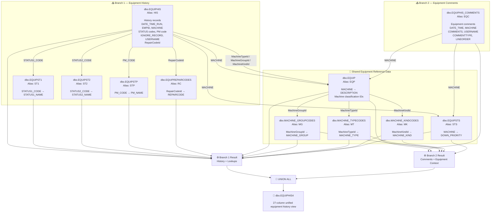
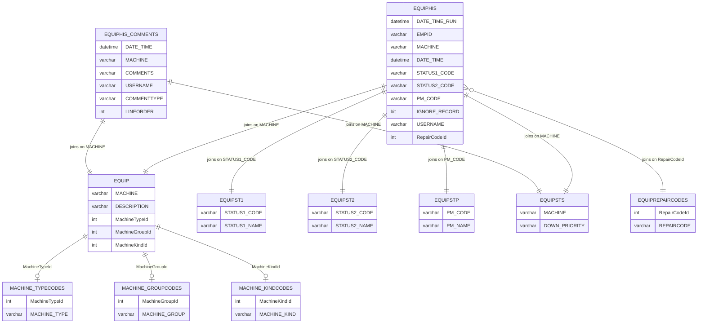

# 📊 View Documentation: `dbo.EQUIPHIS4`

> **Object Type:** SQL View &nbsp;|&nbsp; **Schema:** `dbo` &nbsp;|&nbsp; **Domain:** Equipment History / Equipment Status / Maintenance Comments

---

## 📑 Table of Contents

1. [SQL View Definition](#-sql-view-definition)
2. [View Overview](#-view-overview)
3. [Source Objects & Dependencies](#-source-objects--dependencies)
4. [Architecture & Data Lineage Flowchart](#-architecture--data-lineage-flowchart)
5. [Entity Relationship Diagram](#-entity-relationship-diagram)
6. [Output Column Mapping & Transformation Catalog](#-output-column-mapping--transformation-catalog)
7. [Detailed Query Logic](#-detailed-query-logic)
8. [UNION ALL Behavior](#-union-all-behavior)
9. [Business/Data Interpretation](#-businessdata-interpretation)
10. [Join Analysis](#-join-analysis)
11. [NULL, Constant & Default Values](#-null-constant--default-values)
12. [Concurrency & Performance Considerations](#-concurrency--performance-considerations)
13. [Dependency Summary](#-dependency-summary)

---

## 💻 SQL View Definition

```sql
CREATE VIEW [dbo].[EQUIPHIS4] (
  DATE_TIME_RUN,EMPID,MACHINE,MACHINE_DESCRIPTION
 ,MACHINE_GROUP,MACHINE_TYPE,MACHINE_KIND
 ,DATE_TIME,STATUS1_CODE,STATUS1_NAME,STATUS2_CODE,STATUS2_NAME
 ,PM_CODE,PM_NAME,REPAIR1_CODE,REPAIR1_NAME
 ,REPAIR2_CODE,REPAIR2_NAME,REPAIR3_CODE,REPAIR3_NAME
 ,IGNORE_RECORD,COMMENTS,USERNAME,COMMENTTYPE,LINEORDER
 ,MACHINE_PRIORITY,REPAIRCODE
) AS
SELECT
  HIS.DATE_TIME_RUN,HIS.EMPID,HIS.MACHINE,EQP.DESCRIPTION
 ,MG.MACHINE_GROUP, MT.MACHINE_TYPE, MK.MACHINE_KIND
 ,HIS.DATE_TIME,HIS.STATUS1_CODE,ST1.STATUS1_NAME,HIS.STATUS2_CODE,ST2.STATUS2_NAME
 ,HIS.PM_CODE,STP.PM_NAME
 ,NULL,NULL,NULL,NULL,NULL,NULL
 ,HIS.IGNORE_RECORD,'' AS COMMENTS
 ,HIS.USERNAME,'CS' AS COMMENTTYPE,1 AS LINEORDER
 ,STS.DOWN_PRIORITY AS MACHINE_PRIORITY
 ,RC.REPAIRCODE
  FROM dbo.EQUIPHIS HIS (NOLOCK)
       INNER JOIN dbo.EQUIPST1 ST1 (NOLOCK) ON (ST1.STATUS1_CODE=HIS.STATUS1_CODE)
       INNER JOIN dbo.EQUIPST2 ST2 (NOLOCK) ON (ST2.STATUS2_CODE=HIS.STATUS2_CODE)
       INNER JOIN dbo.EQUIPSTP STP (NOLOCK) ON (STP.PM_CODE=HIS.PM_CODE)
       INNER JOIN dbo.EQUIP EQP (NOLOCK) ON (EQP.MACHINE=HIS.MACHINE)
       LEFT JOIN dbo.MACHINE_TYPECODES MT (NOLOCK) ON MT.MachineTypeId = EQP.MachineTypeId
       LEFT JOIN dbo.MACHINE_GROUPCODES MG (NOLOCK) ON MG.MachineGroupId = EQP.MachineGroupId
       LEFT JOIN [dbo].[MACHINE_KINDCODES] MK (NOLOCK) ON MK.[MachineKindId] = EQP.[MachineKindId]
       INNER JOIN dbo.EQUIPSTS STS (NOLOCK) ON (STS.MACHINE=HIS.MACHINE)
       LEFT OUTER JOIN dbo.EQUIPREPAIRCODES RC (NOLOCK) ON (RC.RepairCodeId=HIS.RepairCodeId)

UNION ALL

SELECT
  EQC.DATE_TIME,NULL,EQC.MACHINE,EQP.DESCRIPTION
 ,MG.MACHINE_GROUP, MT.MACHINE_TYPE, MK.MACHINE_KIND
 ,EQC.DATE_TIME,NULL,NULL,NULL,NULL
 ,NULL,NULL
 ,NULL,NULL,NULL,NULL,NULL,NULL
 ,NULL
 ,EQC.COMMENTS,EQC.USERNAME,EQC.COMMENTTYPE,EQC.LINEORDER
 ,STS.DOWN_PRIORITY
 ,NULL
  FROM dbo.EQUIPHIS_COMMENTS EQC (NOLOCK)
       INNER JOIN dbo.EQUIP EQP (NOLOCK) ON (EQC.MACHINE=EQP.MACHINE)
       LEFT JOIN dbo.MACHINE_TYPECODES MT (NOLOCK) ON MT.MachineTypeId = EQP.MachineTypeId
       LEFT JOIN dbo.MACHINE_GROUPCODES MG (NOLOCK) ON MG.MachineGroupId = EQP.MachineGroupId
       LEFT JOIN [dbo].[MACHINE_KINDCODES] MK (NOLOCK) ON MK.[MachineKindId] = EQP.MachineKindId
       INNER JOIN dbo.EQUIPSTS STS (NOLOCK) ON (EQC.MACHINE=STS.MACHINE)

GO
```

---

## 🔎 View Overview

`dbo.EQUIPHIS4` combines **two different equipment-history data sources** into a single output structure using `UNION ALL`.

### Source branch 1 — Equipment history

The first `SELECT` is based on:

- `dbo.EQUIPHIS`
- Equipment status/code lookup tables
- `dbo.EQUIP`
- Machine classification lookup tables
- `dbo.EQUIPSTS`
- Equipment repair-code lookup

This branch provides detailed equipment history information such as:

- Run timestamp
- Employee ID
- Machine
- Machine description
- Machine group/type/kind
- Equipment date/time
- Status 1 and Status 2
- Preventive-maintenance code/name
- Ignore-record flag
- Username
- Machine priority
- Repair code

### Source branch 2 — Equipment comments

The second `SELECT` is based on:

- `dbo.EQUIPHIS_COMMENTS`
- `dbo.EQUIP`
- Machine classification lookup tables
- `dbo.EQUIPSTS`

This branch provides equipment comment records while conforming to the same 27-column output structure.

### Important observation

The view does **not** apply a `WHERE` filter. Records included in the final result are determined primarily by the `INNER JOIN` conditions in each branch.

---

## 🧩 Source Objects & Dependencies

There are **11 distinct source tables** referenced by the view.

| # | Source Table | Alias | Used In | Purpose in View |
|---:|---|---|---|---|
| 1 | `dbo.EQUIPHIS` | `HIS` | Branch 1 | Primary equipment history records |
| 2 | `dbo.EQUIPST1` | `ST1` | Branch 1 | Resolves `STATUS1_CODE` to `STATUS1_NAME` |
| 3 | `dbo.EQUIPST2` | `ST2` | Branch 1 | Resolves `STATUS2_CODE` to `STATUS2_NAME` |
| 4 | `dbo.EQUIPSTP` | `STP` | Branch 1 | Resolves `PM_CODE` to `PM_NAME` |
| 5 | `dbo.EQUIP` | `EQP` | Both branches | Equipment master data and machine description |
| 6 | `dbo.MACHINE_TYPECODES` | `MT` | Both branches | Machine type classification |
| 7 | `dbo.MACHINE_GROUPCODES` | `MG` | Both branches | Machine group classification |
| 8 | `dbo.MACHINE_KINDCODES` | `MK` | Both branches | Machine kind classification |
| 9 | `dbo.EQUIPSTS` | `STS` | Both branches | Machine status / downtime priority |
| 10 | `dbo.EQUIPREPAIRCODES` | `RC` | Branch 1 | Resolves `RepairCodeId` to `REPAIRCODE` |
| 11 | `dbo.EQUIPHIS_COMMENTS` | `EQC` | Branch 2 | Equipment history comments |

### Table count

| Metric | Count |
|---|---:|
| Distinct source tables | **11** |
| Tables in Branch 1 | **10** |
| Tables in Branch 2 | **6** |
| Tables shared by both branches | **5** |
| Output columns | **27** |
| Query branches | **2** |

---

## 🔀 Architecture & Data Lineage Flowchart



---

## 📐 Entity Relationship Diagram

> The relationships below represent the join paths explicitly defined in the view. The SQL does not provide formal primary-key/foreign-key declarations, so the diagram should be interpreted as **view-level lineage**, not as a definitive database ER model.



---

# 📋 Output Column Mapping & Transformation Catalog

The view exposes **27 output columns**.

| # | Target Column | Branch 1 Source Expression | Branch 2 Source Expression | Source / Logic | Transformation / Notes |
|---:|---|---|---|---|---|
| 1 | `DATE_TIME_RUN` | `HIS.DATE_TIME_RUN` | `EQC.DATE_TIME` | `EQUIPHIS` / `EQUIPHIS_COMMENTS` | Direct source in each branch; second branch uses comment timestamp |
| 2 | `EMPID` | `HIS.EMPID` | `NULL` | `EQUIPHIS` | Employee ID available only for history records |
| 3 | `MACHINE` | `HIS.MACHINE` | `EQC.MACHINE` | Both source tables | Machine identifier |
| 4 | `MACHINE_DESCRIPTION` | `EQP.DESCRIPTION` | `EQP.DESCRIPTION` | `EQUIP` | Equipment description lookup |
| 5 | `MACHINE_GROUP` | `MG.MACHINE_GROUP` | `MG.MACHINE_GROUP` | `MACHINE_GROUPCODES` | Machine group lookup |
| 6 | `MACHINE_TYPE` | `MT.MACHINE_TYPE` | `MT.MACHINE_TYPE` | `MACHINE_TYPECODES` | Machine type lookup |
| 7 | `MACHINE_KIND` | `MK.MACHINE_KIND` | `MK.MACHINE_KIND` | `MACHINE_KINDCODES` | Machine kind lookup |
| 8 | `DATE_TIME` | `HIS.DATE_TIME` | `EQC.DATE_TIME` | Both source tables | Event/comment timestamp |
| 9 | `STATUS1_CODE` | `HIS.STATUS1_CODE` | `NULL` | `EQUIPHIS` | Status code from history branch |
| 10 | `STATUS1_NAME` | `ST1.STATUS1_NAME` | `NULL` | `EQUIPST1` | Status 1 description |
| 11 | `STATUS2_CODE` | `HIS.STATUS2_CODE` | `NULL` | `EQUIPHIS` | Status code from history branch |
| 12 | `STATUS2_NAME` | `ST2.STATUS2_NAME` | `NULL` | `EQUIPST2` | Status 2 description |
| 13 | `PM_CODE` | `HIS.PM_CODE` | `NULL` | `EQUIPHIS` | Preventive-maintenance code |
| 14 | `PM_NAME` | `STP.PM_NAME` | `NULL` | `EQUIPSTP` | Preventive-maintenance name |
| 15 | `REPAIR1_CODE` | `NULL` | `NULL` | Explicit constant | No source expression in either branch |
| 16 | `REPAIR1_NAME` | `NULL` | `NULL` | Explicit constant | No source expression in either branch |
| 17 | `REPAIR2_CODE` | `NULL` | `NULL` | Explicit constant | No source expression in either branch |
| 18 | `REPAIR2_NAME` | `NULL` | `NULL` | Explicit constant | No source expression in either branch |
| 19 | `REPAIR3_CODE` | `NULL` | `NULL` | Explicit constant | No source expression in either branch |
| 20 | `REPAIR3_NAME` | `NULL` | `NULL` | Explicit constant | No source expression in either branch |
| 21 | `IGNORE_RECORD` | `HIS.IGNORE_RECORD` | `NULL` | `EQUIPHIS` | Ignore flag only supplied by history branch |
| 22 | `COMMENTS` | `''` | `EQC.COMMENTS` | Both branches | Empty string for history rows; actual comments for comment rows |
| 23 | `USERNAME` | `HIS.USERNAME` | `EQC.USERNAME` | Both source tables | User associated with the record |
| 24 | `COMMENTTYPE` | `'CS'` | `EQC.COMMENTTYPE` | Constant / source | History rows are assigned `CS`; comment rows use source value |
| 25 | `LINEORDER` | `1` | `EQC.LINEORDER` | Constant / source | History rows assigned order `1`; comment rows use source order |
| 26 | `MACHINE_PRIORITY` | `STS.DOWN_PRIORITY` | `STS.DOWN_PRIORITY` | `EQUIPSTS` | Machine downtime priority |
| 27 | `REPAIRCODE` | `RC.REPAIRCODE` | `NULL` | `EQUIPREPAIRCODES` | Repair code description/value only available in history branch |

---

# 🧠 Detailed Query Logic

## 1. Branch 1 — Equipment History Records

The first `SELECT` begins with:

```sql
FROM dbo.EQUIPHIS HIS (NOLOCK)
```

`EQUIPHIS` is therefore the primary driving table for the first branch.

The query enriches each history record using several lookup/reference tables.

### 1.1 Status 1 lookup

```sql
INNER JOIN dbo.EQUIPST1 ST1 (NOLOCK)
    ON ST1.STATUS1_CODE = HIS.STATUS1_CODE
```

The source history record contains `STATUS1_CODE`.

The lookup provides:

```text
STATUS1_CODE → STATUS1_NAME
```

Both the code and name are exposed in the view.

---

### 1.2 Status 2 lookup

```sql
INNER JOIN dbo.EQUIPST2 ST2 (NOLOCK)
    ON ST2.STATUS2_CODE = HIS.STATUS2_CODE
```

This resolves:

```text
STATUS2_CODE → STATUS2_NAME
```

Because this is an `INNER JOIN`, a history record without a matching `EQUIPST2` record will not appear in Branch 1.

---

### 1.3 Preventive-maintenance lookup

```sql
INNER JOIN dbo.EQUIPSTP STP (NOLOCK)
    ON STP.PM_CODE = HIS.PM_CODE
```

This resolves:

```text
PM_CODE → PM_NAME
```

The lookup is an `INNER JOIN`, so a missing PM lookup match can exclude the corresponding history record.

---

### 1.4 Equipment master lookup

```sql
INNER JOIN dbo.EQUIP EQP (NOLOCK)
    ON EQP.MACHINE = HIS.MACHINE
```

This provides equipment-level information associated with the machine:

```text
MACHINE → DESCRIPTION
MACHINE → MachineTypeId
MACHINE → MachineGroupId
MACHINE → MachineKindId
```

The view then uses those classification IDs to retrieve descriptive machine classifications.

---

### 1.5 Machine type lookup

```sql
LEFT JOIN dbo.MACHINE_TYPECODES MT (NOLOCK)
    ON MT.MachineTypeId = EQP.MachineTypeId
```

This provides:

```text
MachineTypeId → MACHINE_TYPE
```

It is a `LEFT JOIN`, meaning that a missing machine-type mapping does not by itself remove the equipment history record.

---

### 1.6 Machine group lookup

```sql
LEFT JOIN dbo.MACHINE_GROUPCODES MG (NOLOCK)
    ON MG.MachineGroupId = EQP.MachineGroupId
```

This provides:

```text
MachineGroupId → MACHINE_GROUP
```

Again, because this is a `LEFT JOIN`, the classification can be `NULL` if no corresponding lookup record exists.

---

### 1.7 Machine kind lookup

```sql
LEFT JOIN dbo.MACHINE_KINDCODES MK (NOLOCK)
    ON MK.MachineKindId = EQP.MachineKindId
```

This provides:

```text
MachineKindId → MACHINE_KIND
```

The lookup is optional because it uses `LEFT JOIN`.

---

### 1.8 Machine status / priority lookup

```sql
INNER JOIN dbo.EQUIPSTS STS (NOLOCK)
    ON STS.MACHINE = HIS.MACHINE
```

This provides:

```text
MACHINE → DOWN_PRIORITY
```

The resulting value is exposed as:

```sql
STS.DOWN_PRIORITY AS MACHINE_PRIORITY
```

Because this is an `INNER JOIN`, a history record without a corresponding `EQUIPSTS` record is excluded from Branch 1.

---

### 1.9 Repair code lookup

```sql
LEFT OUTER JOIN dbo.EQUIPREPAIRCODES RC (NOLOCK)
    ON RC.RepairCodeId = HIS.RepairCodeId
```

This resolves:

```text
RepairCodeId → REPAIRCODE
```

Because this is a `LEFT OUTER JOIN`, the history record remains available even when no matching repair-code record exists.

---

# 2. Branch 2 — Equipment Comment Records

The second branch starts with:

```sql
FROM dbo.EQUIPHIS_COMMENTS EQC (NOLOCK)
```

This makes `EQUIPHIS_COMMENTS` the driving table for the comment branch.

It enriches comment records with equipment and machine classification information.

### 2.1 Equipment lookup

```sql
INNER JOIN dbo.EQUIP EQP (NOLOCK)
    ON EQC.MACHINE = EQP.MACHINE
```

The machine is used to retrieve:

```text
MACHINE_DESCRIPTION
MACHINE_TYPE
MACHINE_GROUP
MACHINE_KIND
```

---

### 2.2 Machine classification lookups

The same three optional classification lookups are used:

```sql
LEFT JOIN dbo.MACHINE_TYPECODES MT
    ON MT.MachineTypeId = EQP.MachineTypeId

LEFT JOIN dbo.MACHINE_GROUPCODES MG
    ON MG.MachineGroupId = EQP.MachineGroupId

LEFT JOIN dbo.MACHINE_KINDCODES MK
    ON MK.MachineKindId = EQP.MachineKindId
```

---

### 2.3 Machine priority

The comment branch also requires:

```sql
INNER JOIN dbo.EQUIPSTS STS
    ON EQC.MACHINE = STS.MACHINE
```

and exposes:

```sql
STS.DOWN_PRIORITY AS MACHINE_PRIORITY
```

Therefore, a comment record must have both a matching equipment record and a matching `EQUIPSTS` record to appear in Branch 2.

---

# 🔀 UNION ALL Behavior

The two branches are combined with:

```sql
UNION ALL
```

This is important because `UNION ALL` **does not remove duplicate rows**.

Conceptually:

```text
                  ┌─────────────────────────┐
                  │ dbo.EQUIPHIS             │
                  │ Equipment History        │
                  └────────────┬────────────┘
                               │
                         Branch 1 Result
                               │
                               ├──────────┐
                               │          │
                               ▼          │
                         ┌───────────┐    │
                         │ UNION ALL │ ◄──┤
                         └─────┬─────┘    │
                               ▲          │
                               │          │
                         Branch 2 Result  │
                               │          │
                  ┌────────────┴────────────┐
                  │ dbo.EQUIPHIS_COMMENTS   │
                  │ Equipment Comments      │
                  └─────────────────────────┘
```

### Why the column alignment matters

Both `SELECT` statements return the same number of columns in the same positional order.

For example:

```text
Column 1  → DATE_TIME_RUN
Column 2  → EMPID
Column 3  → MACHINE
...
Column 27 → REPAIRCODE
```

The second branch therefore uses `NULL` values for columns that do not apply to comment records.

---

# 🧾 Business/Data Interpretation

Based strictly on the SQL, the view creates a **common reporting structure for equipment history and equipment comments**.

A consumer querying:

```sql
SELECT *
FROM dbo.EQUIPHIS4;
```

can receive two kinds of records:

### A. Equipment history records

These contain history-oriented fields such as:

- `EMPID`
- `STATUS1_CODE`
- `STATUS1_NAME`
- `STATUS2_CODE`
- `STATUS2_NAME`
- `PM_CODE`
- `PM_NAME`
- `IGNORE_RECORD`
- `REPAIRCODE`

The history branch sets:

```sql
COMMENTTYPE = 'CS'
LINEORDER = 1
COMMENTS = ''
```

### B. Equipment comment records

These contain:

- `COMMENTS`
- `USERNAME`
- `COMMENTTYPE`
- `LINEORDER`

while history-specific fields such as status and PM information are `NULL`.

This structure allows both record types to be consumed through one common view.

---

# 🔗 Join Analysis

| Join | Type | Join Condition | Effect |
|---|---|---|---|
| `EQUIPHIS → EQUIPST1` | `INNER JOIN` | `STATUS1_CODE` | Requires matching Status 1 lookup |
| `EQUIPHIS → EQUIPST2` | `INNER JOIN` | `STATUS2_CODE` | Requires matching Status 2 lookup |
| `EQUIPHIS → EQUIPSTP` | `INNER JOIN` | `PM_CODE` | Requires matching PM lookup |
| `EQUIPHIS → EQUIP` | `INNER JOIN` | `MACHINE` | Requires matching equipment |
| `EQUIP → MACHINE_TYPECODES` | `LEFT JOIN` | `MachineTypeId` | Optional machine type enrichment |
| `EQUIP → MACHINE_GROUPCODES` | `LEFT JOIN` | `MachineGroupId` | Optional machine group enrichment |
| `EQUIP → MACHINE_KINDCODES` | `LEFT JOIN` | `MachineKindId` | Optional machine kind enrichment |
| `EQUIPHIS → EQUIPSTS` | `INNER JOIN` | `MACHINE` | Requires machine status/priority record |
| `EQUIPHIS → EQUIPREPAIRCODES` | `LEFT OUTER JOIN` | `RepairCodeId` | Optional repair-code enrichment |
| `EQUIPHIS_COMMENTS → EQUIP` | `INNER JOIN` | `MACHINE` | Requires matching equipment |
| `EQUIPHIS_COMMENTS → EQUIPSTS` | `INNER JOIN` | `MACHINE` | Requires machine priority record |
| `EQUIP → MACHINE_TYPECODES` | `LEFT JOIN` | `MachineTypeId` | Optional machine type enrichment |
| `EQUIP → MACHINE_GROUPCODES` | `LEFT JOIN` | `MachineGroupId` | Optional machine group enrichment |
| `EQUIP → MACHINE_KINDCODES` | `LEFT JOIN` | `MachineKindId` | Optional machine kind enrichment |

---

# 🟦 Inner Join vs. Left Join Behavior

## INNER JOIN

The following relationships use `INNER JOIN`:

```text
EQUIPHIS → EQUIPST1
EQUIPHIS → EQUIPST2
EQUIPHIS → EQUIPSTP
EQUIPHIS → EQUIP
EQUIPHIS → EQUIPSTS

EQUIPHIS_COMMENTS → EQUIP
EQUIPHIS_COMMENTS → EQUIPSTS
```

An unmatched record can therefore be removed from the corresponding branch.

### Example

If:

```text
EQUIPHIS.MACHINE = 'M001'
```

but there is no:

```text
EQUIP.MACHINE = 'M001'
```

then that `EQUIPHIS` record will not be returned by Branch 1.

---

## LEFT JOIN

The optional enrichment relationships include:

```text
EQUIP → MACHINE_TYPECODES
EQUIP → MACHINE_GROUPCODES
EQUIP → MACHINE_KINDCODES
EQUIPHIS → EQUIPREPAIRCODES
```

A missing lookup value results in `NULL` for the associated output column while preserving the base record.

---

# ⬜ NULL, Constant & Default Values

Several output columns are deliberately populated with `NULL` or constants depending on the branch.

## Branch 1

| Output Column | Value |
|---|---|
| `REPAIR1_CODE` | `NULL` |
| `REPAIR1_NAME` | `NULL` |
| `REPAIR2_CODE` | `NULL` |
| `REPAIR2_NAME` | `NULL` |
| `REPAIR3_CODE` | `NULL` |
| `REPAIR3_NAME` | `NULL` |
| `COMMENTS` | `''` |
| `COMMENTTYPE` | `'CS'` |
| `LINEORDER` | `1` |

## Branch 2

| Output Column | Value |
|---|---|
| `EMPID` | `NULL` |
| `STATUS1_CODE` | `NULL` |
| `STATUS1_NAME` | `NULL` |
| `STATUS2_CODE` | `NULL` |
| `STATUS2_NAME` | `NULL` |
| `PM_CODE` | `NULL` |
| `PM_NAME` | `NULL` |
| `REPAIR1_CODE` | `NULL` |
| `REPAIR1_NAME` | `NULL` |
| `REPAIR2_CODE` | `NULL` |
| `REPAIR2_NAME` | `NULL` |
| `REPAIR3_CODE` | `NULL` |
| `REPAIR3_NAME` | `NULL` |
| `IGNORE_RECORD` | `NULL` |
| `REPAIRCODE` | `NULL` |

---

# ⚡ Concurrency & Performance Considerations

## 1. `NOLOCK` hints

The view uses `NOLOCK` on all source tables referenced by the queries.

Example:

```sql
FROM dbo.EQUIPHIS HIS (NOLOCK)
```

and:

```sql
INNER JOIN dbo.EQUIP EQP (NOLOCK)
```

`NOLOCK` corresponds to a read-uncommitted style of access. As a result, queries against the view can potentially read data that is being changed by concurrent transactions.

Potential implications include:

- Dirty reads
- Non-repeatable reads
- Rows appearing or disappearing during a scan
- Potentially inconsistent results during concurrent updates

The exact impact depends on the underlying workload and SQL Server execution behavior.

---

## 2. Multiple lookup joins

Branch 1 performs multiple joins against reference tables:

```text
EQUIPST1
EQUIPST2
EQUIPSTP
EQUIP
MACHINE_TYPECODES
MACHINE_GROUPCODES
MACHINE_KINDCODES
EQUIPSTS
EQUIPREPAIRCODES
```

The availability of suitable indexes on the join columns can materially affect query performance.

---

## 3. `UNION ALL`

The use of:

```sql
UNION ALL
```

avoids the duplicate-elimination step associated with `UNION`.

This is generally important when the intention is to preserve all rows from both branches.

It also means that consumers should not assume the view itself removes duplicate-looking records.

---

## 4. Potential row multiplication

If a lookup table contains multiple matching rows for a join key, a source record can produce multiple output rows.

For example:

```sql
EQUIPSTS.MACHINE = HIS.MACHINE
```

is expected to provide the relevant machine priority. If multiple `EQUIPSTS` rows exist for the same `MACHINE`, the join can multiply the corresponding history records.

The SQL itself does not contain a `DISTINCT`, aggregation, or other deduplication mechanism to prevent this.

---

## 5. Suggested areas for index validation

The SQL contains joins on the following columns, which are natural candidates for index review:

```text
EQUIPHIS.STATUS1_CODE
EQUIPHIS.STATUS2_CODE
EQUIPHIS.PM_CODE
EQUIPHIS.MACHINE
EQUIPHIS.RepairCodeId

EQUIPHIS_COMMENTS.MACHINE

EQUIP.MACHINE
EQUIP.MachineTypeId
EQUIP.MachineGroupId
EQUIP.MachineKindId

EQUIPST1.STATUS1_CODE
EQUIPST2.STATUS2_CODE
EQUIPSTP.PM_CODE

MACHINE_TYPECODES.MachineTypeId
MACHINE_GROUPCODES.MachineGroupId
MACHINE_KINDCODES.MachineKindId

EQUIPSTS.MACHINE
EQUIPREPAIRCODES.RepairCodeId
```

> **Note:** This is an index-review checklist derived from the join predicates. The actual index recommendations should be validated against table sizes, existing indexes, query plans, and workload characteristics.

---

# 📦 Dependency Summary

## Primary data sources

### `dbo.EQUIPHIS`

Primary source for equipment history records.

Key fields referenced:

```text
DATE_TIME_RUN
EMPID
MACHINE
DATE_TIME
STATUS1_CODE
STATUS2_CODE
PM_CODE
IGNORE_RECORD
USERNAME
RepairCodeId
```

### `dbo.EQUIPHIS_COMMENTS`

Primary source for equipment comment records.

Key fields referenced:

```text
DATE_TIME
MACHINE
COMMENTS
USERNAME
COMMENTTYPE
LINEORDER
```

---

## Equipment reference

### `dbo.EQUIP`

Provides:

```text
DESCRIPTION
MachineTypeId
MachineGroupId
MachineKindId
```

and is used by both branches.

---

## Status and PM reference tables

```text
dbo.EQUIPST1
dbo.EQUIPST2
dbo.EQUIPSTP
```

These provide descriptive names for status and PM codes.

---

## Machine classification tables

```text
dbo.MACHINE_TYPECODES
dbo.MACHINE_GROUPCODES
dbo.MACHINE_KINDCODES
```

These provide machine classification descriptions.

---

## Machine status table

```text
dbo.EQUIPSTS
```

Provides:

```text
DOWN_PRIORITY
```

which is exposed as:

```text
MACHINE_PRIORITY
```

---

## Repair code table

```text
dbo.EQUIPREPAIRCODES
```

Provides:

```text
REPAIRCODE
```

for history records through:

```sql
RC.RepairCodeId = HIS.RepairCodeId
```

---

# 🧭 End-to-End Data Flow Summary

```text
                         ┌─────────────────────┐
                         │   dbo.EQUIPHIS      │
                         │ Equipment History   │
                         └──────────┬──────────┘
                                    │
                ┌───────────────────┼────────────────────┐
                │                   │                    │
                ▼                   ▼                    ▼
          Status Lookups       Equipment Master     Repair Lookup
          ST1 / ST2 / STP          EQUIP                 RC
                │                   │
                │          ┌────────┼─────────┐
                │          ▼        ▼         ▼
                │         MT       MG        MK
                │
                └───────────────────┐
                                    ▼
                              EQUIPSTS
                                    │
                                    ▼
                         ┌───────────────────┐
                         │   Branch 1        │
                         │ History Records   │
                         └─────────┬─────────┘
                                   │
                                   │
                                   │ UNION ALL
                                   │
                                   ▼
                         ┌───────────────────┐
                         │   dbo.EQUIPHIS4   │
                         │   27 columns      │
                         └───────────────────┘
                                   ▲
                                   │
                                   │
                         ┌─────────┴─────────┐
                         │   Branch 2        │
                         │ Comment Records  │
                         └─────────▲─────────┘
                                   │
                         ┌─────────┴─────────┐
                         │EQUIPHIS_COMMENTS  │
                         └─────────┬─────────┘
                                   │
                                   ▼
                                EQUIP
                                   │
                         ┌─────────┼─────────┐
                         ▼         ▼         ▼
                        MT        MG        MK
                                   │
                                   ▼
                                EQUIPSTS
```

---

# ✅ Summary

`dbo.EQUIPHIS4` is a **27-column consolidated equipment-history view** composed of two `SELECT` branches joined using `UNION ALL`.

### Key characteristics

- **11 distinct source tables**
- **2 data branches**
- **27 output columns**
- Branch 1 is driven by `dbo.EQUIPHIS`
- Branch 2 is driven by `dbo.EQUIPHIS_COMMENTS`
- `dbo.EQUIP` provides common machine information
- Machine type, group, and kind are optional enrichments through `LEFT JOIN`
- Status, PM, equipment, and machine-priority relationships use `INNER JOIN`
- Repair code enrichment is optional through `LEFT OUTER JOIN`
- History rows use `COMMENTTYPE = 'CS'`
- History rows use `LINEORDER = 1`
- Comment rows retain their source `COMMENTTYPE` and `LINEORDER`
- Several history-specific and repair-specific columns are intentionally `NULL` for comment records
- `UNION ALL` preserves rows from both branches without duplicate elimination
- `NOLOCK` is applied throughout the source queries
- No `WHERE` clause is present in either branch

> **Documentation scope:** All mappings, joins, transformations, and interpretations above are derived from the supplied `dbo.EQUIPHIS4` SQL definition. Data types, primary keys, foreign keys, database/environment metadata, and the business meaning of individual codes are not specified by the supplied SQL and should be validated against the underlying database documentation.
