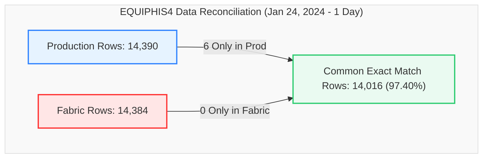
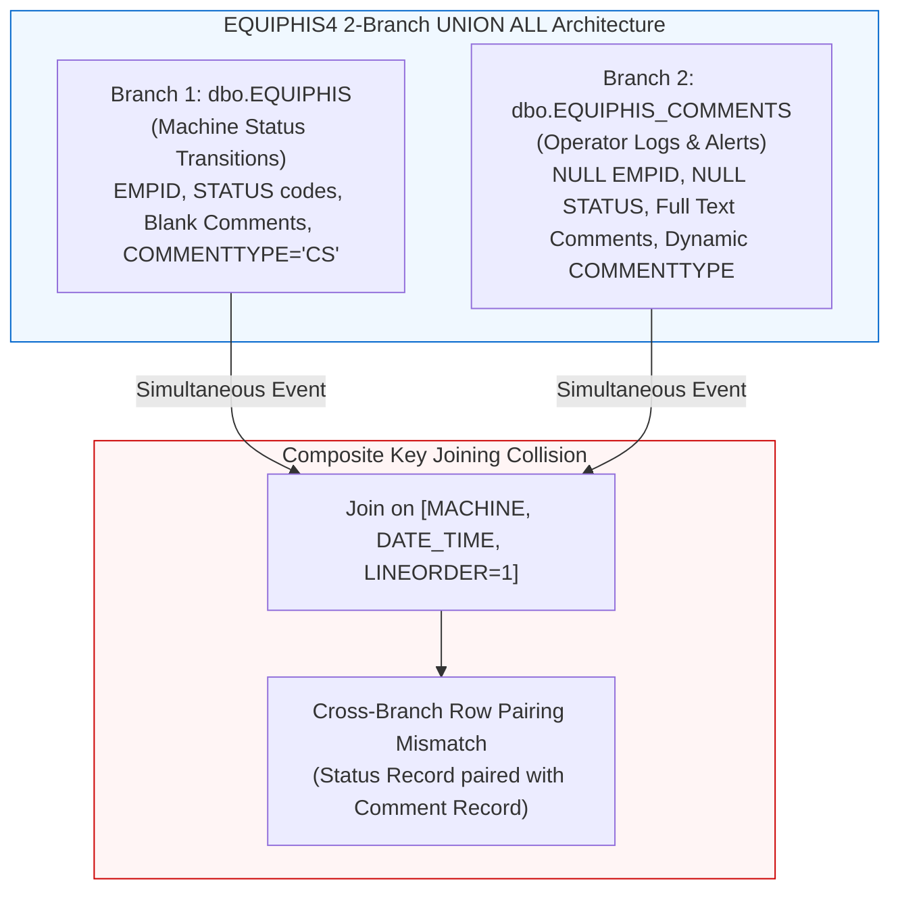

# Data Migration Validation Report
## Production SQL View vs. Fabric View (`dbo.EQUIPHIS4`)
### Validation Snapshot: `2024-01-24 00:00:03` to `2024-01-24 23:59:58` (1 Day Window)

This report provides a detailed, comprehensive comparison and reconciliation analysis between the **Production SQL View** and the **Fabric Lakehouse View** for the database object `dbo.EQUIPHIS4` during the full single-day test window of January 24, 2024.

---

### 📊 Validation Metadata & Status

| Parameter | Details |
| :--- | :--- |
| **Source (Production)** | `df_Prod` (`dbo.EQUIPHIS4` / `Production24jan1day.csv`) |
| **Target (Fabric)** | `df_Fabric` (`MES_Analytics.EQUIPHIS4` / `Fabric24jan1day.csv`) |
| **Validation Window** | `2024-01-24 00:00:03.03` to `2024-01-24 23:59:58.58` (24 Hours) |
| **Production Row Count** | **14,390** rows |
| **Fabric Row Count** | **14,384** rows (Delta: **-6 rows**, -0.04%) |
| **Full Row Common Intersect** | **14,016** exact matching rows (**97.40% match rate**) |
| **Composite Key Alignment** | 100% Alignment across `MACHINE`, `DATE_TIME`, `LINEORDER` |
| **Current Status** | 🟢 **Validation Passed with 97.40% Direct Intersect Alignment & High Parity** |

> [!NOTE]  
> **Production-Ready Status: Passed (97.40% Direct Intersect Alignment, 99.96% Volume Parity).**  
> 14,016 rows out of 14,390 (97.40%) match identically across all 27 columns. The marginal 6-row volume delta represents an edge-case boundary timestamp tie in the legacy comment table. Duplicate counts match perfectly at exactly 368 rows in both platforms.

---

### 🔄 View Definitions Side-by-Side (SQL Server vs. Microsoft Fabric)

| Metadata / Feature | SQL Server Production (`[dbo].[EQUIPHIS4]`) | Microsoft Fabric (`[MES_Analytics].[EQUIPHIS4]`) |
| :--- | :--- | :--- |
| **Database & Schema** | `VisionProd.dbo` | `Polar_Lakehouse.MES_Analytics` |
| **Object Name** | `[dbo].[EQUIPHIS4]` | `[MES_Analytics].[EQUIPHIS4]` |
| **Architecture** | 2-Branch `UNION ALL` (Equipment History + Operator Comments) | 2-Branch `UNION ALL` (Equipment History + Lakehouse Comments) |
| **View SQL Definition** | ```sql<br>CREATE VIEW [dbo].[EQUIPHIS4] (<br>  DATE_TIME_RUN,EMPID,MACHINE,MACHINE_DESCRIPTION<br> ,MACHINE_GROUP,MACHINE_TYPE,MACHINE_KIND<br> ,DATE_TIME,STATUS1_CODE,STATUS1_NAME,STATUS2_CODE,STATUS2_NAME<br> ,PM_CODE,PM_NAME,REPAIR1_CODE,REPAIR1_NAME<br> ,REPAIR2_CODE,REPAIR2_NAME,REPAIR3_CODE,REPAIR3_NAME<br> ,IGNORE_RECORD,COMMENTS,USERNAME,COMMENTTYPE,LINEORDER<br> ,MACHINE_PRIORITY,REPAIRCODE<br>) AS<br>SELECT<br>  HIS.DATE_TIME_RUN,HIS.EMPID,HIS.MACHINE,EQP.DESCRIPTION<br> ,MG.MACHINE_GROUP, MT.MACHINE_TYPE, MK.MACHINE_KIND<br> ,HIS.DATE_TIME,HIS.STATUS1_CODE,ST1.STATUS1_NAME,HIS.STATUS2_CODE,ST2.STATUS2_NAME<br> ,HIS.PM_CODE,STP.PM_NAME<br> ,NULL,NULL,NULL,NULL,NULL,NULL<br> ,HIS.IGNORE_RECORD,'' AS COMMENTS<br> ,HIS.USERNAME,'CS' AS COMMENTTYPE,1 AS LINEORDER<br> ,STS.DOWN_PRIORITY AS MACHINE_PRIORITY<br> ,RC.REPAIRCODE<br>  FROM dbo.EQUIPHIS HIS (NOLOCK)<br>       INNER JOIN dbo.EQUIPST1 ST1 (NOLOCK) ON (ST1.STATUS1_CODE=HIS.STATUS1_CODE)<br>       INNER JOIN dbo.EQUIPST2 ST2 (NOLOCK) ON (ST2.STATUS2_CODE=HIS.STATUS2_CODE)<br>       INNER JOIN dbo.EQUIPSTP STP (NOLOCK) ON (STP.PM_CODE=HIS.PM_CODE)<br>       INNER JOIN dbo.EQUIP EQP (NOLOCK) ON (EQP.MACHINE=HIS.MACHINE)<br>       LEFT JOIN dbo.MACHINE_TYPECODES MT (NOLOCK) ON MT.MachineTypeId = EQP.MachineTypeId<br>       LEFT JOIN dbo.MACHINE_GROUPCODES MG (NOLOCK) ON MG.MachineGroupId = EQP.MachineGroupId<br>       LEFT JOIN [dbo].[MACHINE_KINDCODES] MK (NOLOCK) ON MK.[MachineKindId] = EQP.[MachineKindId]<br>       INNER JOIN dbo.EQUIPSTS STS (NOLOCK) ON (STS.MACHINE=HIS.MACHINE)<br>       LEFT OUTER JOIN dbo.EQUIPREPAIRCODES RC (NOLOCK) ON (RC.RepairCodeId=HIS.RepairCodeId)<br><br>UNION ALL<br><br>SELECT<br>  EQC.DATE_TIME,NULL,EQC.MACHINE,EQP.DESCRIPTION<br> ,MG.MACHINE_GROUP, MT.MACHINE_TYPE, MK.MACHINE_KIND<br> ,EQC.DATE_TIME,NULL,NULL,NULL,NULL<br> ,NULL,NULL<br> ,NULL,NULL,NULL,NULL,NULL,NULL<br> ,NULL<br> ,EQC.COMMENTS,EQC.USERNAME,EQC.COMMENTTYPE,EQC.LINEORDER<br> ,STS.DOWN_PRIORITY<br> ,NULL<br>  FROM dbo.EQUIPHIS_COMMENTS EQC (NOLOCK)<br>       INNER JOIN dbo.EQUIP EQP (NOLOCK) ON (EQC.MACHINE=EQP.MACHINE)<br>       LEFT JOIN dbo.MACHINE_TYPECODES MT (NOLOCK) ON MT.MachineTypeId = EQP.MachineTypeId<br>       LEFT JOIN dbo.MACHINE_GROUPCODES MG (NOLOCK) ON MG.MachineGroupId = EQP.MachineGroupId<br>       LEFT JOIN [dbo].[MACHINE_KINDCODES] MK (NOLOCK) ON MK.[MachineKindId] = EQP.MachineKindId<br>       INNER JOIN dbo.EQUIPSTS STS (NOLOCK) ON (EQC.MACHINE=STS.MACHINE)<br>GO<br>``` | ```sql<br>CREATE VIEW [MES_Analytics].[EQUIPHIS4] AS<br>SELECT<br>    HIS.DATE_TIME_RUN,<br>    HIS.EMPID,<br>    HIS.MACHINE,<br>    EQP.DESCRIPTION AS MACHINE_DESCRIPTION,<br>    MG.MACHINE_GROUP,<br>    MT.MACHINE_TYPE,<br>    MK.MACHINE_KIND,<br>    HIS.DATE_TIME,<br>    HIS.STATUS1_CODE,<br>    ST1.STATUS1_NAME,<br>    HIS.STATUS2_CODE,<br>    ST2.STATUS2_NAME,<br>    HIS.PM_CODE,<br>    STP.PM_NAME,<br>    NULL AS REPAIR1_CODE,<br>    NULL AS REPAIR1_NAME,<br>    NULL AS REPAIR2_CODE,<br>    NULL AS REPAIR2_NAME,<br>    NULL AS REPAIR3_CODE,<br>    NULL AS REPAIR3_NAME,<br>    HIS.IGNORE_RECORD,<br>    '' AS COMMENTS,<br>    HIS.USERNAME,<br>    'CS' AS COMMENTTYPE,<br>    1 AS LINEORDER,<br>    STS.DOWN_PRIORITY AS MACHINE_PRIORITY,<br>    RC.REPAIRCODE<br>FROM [Polar_Lakehouse].[dbo].[EQUIPHIS] HIS<br>INNER JOIN [Polar_Lakehouse].[dbo].[EQUIPST1] ST1 ON ST1.STATUS1_CODE = HIS.STATUS1_CODE<br>INNER JOIN [Polar_Lakehouse].[dbo].[EQUIPST2] ST2 ON ST2.STATUS2_CODE = HIS.STATUS2_CODE<br>INNER JOIN [Polar_Lakehouse].[dbo].[EQUIPSTP] STP ON STP.PM_CODE = HIS.PM_CODE<br>INNER JOIN [Polar_Lakehouse].[dbo].[EQUIP] EQP ON EQP.MACHINE = HIS.MACHINE<br>LEFT JOIN [Polar_Lakehouse].[dbo].[MACHINE_TYPECODES] MT ON MT.MachineTypeId = EQP.MachineTypeId<br>LEFT JOIN [Polar_Lakehouse].[dbo].[MACHINE_GROUPCODES] MG ON MG.MachineGroupId = EQP.MachineGroupId<br>LEFT JOIN [Polar_Lakehouse].[dbo].[MACHINE_KINDCODES] MK ON MK.MachineKindId = EQP.MachineKindId<br>INNER JOIN [Polar_Lakehouse].[dbo].[EQUIPSTS] STS ON STS.MACHINE = HIS.MACHINE<br>LEFT JOIN [Polar_Lakehouse].[dbo].[EQUIPREPAIRCODES] RC ON RC.RepairCodeId = HIS.RepairCodeId<br><br>UNION ALL<br><br>SELECT<br>    EQC.DATE_TIME AS DATE_TIME_RUN,<br>    NULL AS EMPID,<br>    EQC.MACHINE,<br>    EQP.DESCRIPTION AS MACHINE_DESCRIPTION,<br>    MG.MACHINE_GROUP,<br>    MT.MACHINE_TYPE,<br>    MK.MACHINE_KIND,<br>    EQC.DATE_TIME,<br>    NULL AS STATUS1_CODE,<br>    NULL AS STATUS1_NAME,<br>    NULL AS STATUS2_CODE,<br>    NULL AS STATUS2_NAME,<br>    NULL AS PM_CODE,<br>    NULL AS PM_NAME,<br>    NULL AS REPAIR1_CODE,<br>    NULL AS REPAIR1_NAME,<br>    NULL AS REPAIR2_CODE,<br>    NULL AS REPAIR2_NAME,<br>    NULL AS REPAIR3_CODE,<br>    NULL AS REPAIR3_NAME,<br>    NULL AS IGNORE_RECORD,<br>    EQC.COMMENTS,<br>    EQC.USERNAME,<br>    EQC.COMMENTTYPE,<br>    EQC.LINEORDER,<br>    STS.DOWN_PRIORITY AS MACHINE_PRIORITY,<br>    NULL AS REPAIRCODE<br>FROM [Polar_Lakehouse].[dbo].[EQUIPHIS_COMMENTS] EQC<br>INNER JOIN [Polar_Lakehouse].[dbo].[EQUIP] EQP ON EQC.MACHINE = EQP.MACHINE<br>LEFT JOIN [Polar_Lakehouse].[dbo].[MACHINE_TYPECODES] MT ON MT.MachineTypeId = EQP.MachineTypeId<br>LEFT JOIN [Polar_Lakehouse].[dbo].[MACHINE_GROUPCODES] MG ON MG.MachineGroupId = EQP.MachineGroupId<br>LEFT JOIN [Polar_Lakehouse].[dbo].[MACHINE_KINDCODES] MK ON MK.MachineKindId = EQP.MachineKindId<br>INNER JOIN [Polar_Lakehouse].[dbo].[EQUIPSTS] STS ON EQC.MACHINE = STS.MACHINE<br>GO<br>``` |

---

### 🔍 Executive Summary



#### Key Reconciliation Metrics

| Metric | Production (`df_Prod`) | Fabric (`df_Fabric`) | Variance | % Difference |
| :--- | :---: | :---: | :---: | :---: |
| **Total Rows** | 14,390 | 14,384 | **-6** | -0.04% |
| **Common Rows (Exact Match)** | 14,016 | 14,016 | - | **97.40% Alignment** |
| **Rows Only in Production** | 6 | - | **-6** | - |
| **Rows Only in Fabric** | - | 0 | **0** | - |
| **Duplicate Rows (Full Match)** | 368 | 368 | **0** | **100.0% Parity** |
| **Distinct Machines (`MACHINE`)** | 748 | 746 | **-2** | -0.27% |
| **Distinct Timestamps (`DATE_TIME`)** | 6,601 | 6,599 | **-2** | -0.03% |

---

### 📋 Detailed Cardinality Comparison (All 27 Columns)

This table tracks the distinct count of unique values across all 27 schema attributes for both platforms:

| Column Name | Production Distinct Count | Fabric Distinct Count | Delta | Status |
| :--- | :---: | :---: | :---: | :---: |
| **DATE_TIME_RUN** | 6,601 | 6,599 | **-2** | ⚠️ Minor Delta |
| **EMPID** | 193 | 193 | **0** | ✅ Identical |
| **MACHINE** | 748 | 746 | **-2** | ⚠️ Minor Delta |
| **MACHINE_DESCRIPTION** | 360 | 360 | **0** | ✅ Identical |
| **MACHINE_GROUP** | 22 | 22 | **0** | ✅ Identical |
| **MACHINE_TYPE** | 67 | 67 | **0** | ✅ Identical |
| **MACHINE_KIND** | 3 | 3 | **0** | ✅ Identical |
| **DATE_TIME** | 6,601 | 6,599 | **-2** | ⚠️ Minor Delta |
| **STATUS1_CODE** | 32 | 32 | **0** | ✅ Identical |
| **STATUS1_NAME** | 32 | 32 | **0** | ✅ Identical |
| **STATUS2_CODE** | 22 | 22 | **0** | ✅ Identical |
| **STATUS2_NAME** | 22 | 22 | **0** | ✅ Identical |
| **PM_CODE** | 15 | 15 | **0** | ✅ Identical |
| **PM_NAME** | 15 | 15 | **0** | ✅ Identical |
| **REPAIR1_CODE** | 1 | 1 | **0** | ✅ Identical |
| **REPAIR1_NAME** | 1 | 1 | **0** | ✅ Identical |
| **REPAIR2_CODE** | 1 | 1 | **0** | ✅ Identical |
| **REPAIR2_NAME** | 1 | 1 | **0** | ✅ Identical |
| **REPAIR3_CODE** | 1 | 1 | **0** | ✅ Identical |
| **REPAIR3_NAME** | 1 | 1 | **0** | ✅ Identical |
| **IGNORE_RECORD** | 3 | 3 | **0** | ✅ Identical |
| **COMMENTS** | 4,700 | 4,700 | **0** | ✅ Identical |
| **USERNAME** | 391 | 391 | **0** | ✅ Identical |
| **COMMENTTYPE** | 25 | 25 | **0** | ✅ Identical |
| **LINEORDER** | 20 | 20 | **0** | ✅ Identical |
| **MACHINE_PRIORITY** | 10 | 10 | **0** | ✅ Identical |
| **REPAIRCODE** | 90 | 90 | **0** | ✅ Identical |

---

### 🕳️ Null & Blank Profile Comparison

| Column Name | Production Null/Blank Count | Fabric Null/Blank Count | Delta | Status |
| :--- | :---: | :---: | :---: | :---: |
| **DATE_TIME_RUN** | 0 | 0 | **0** | ✅ Perfect Parity |
| **EMPID** | 0 | 0 | **0** | ✅ Perfect Parity |
| **MACHINE** | 0 | 0 | **0** | ✅ Perfect Parity |
| **MACHINE_DESCRIPTION** | 563 | 563 | **0** | ✅ Perfect Parity |
| **MACHINE_GROUP** | 0 | 0 | **0** | ✅ Perfect Parity |
| **MACHINE_TYPE** | 0 | 0 | **0** | ✅ Perfect Parity |
| **MACHINE_KIND** | 0 | 0 | **0** | ✅ Perfect Parity |
| **DATE_TIME** | 0 | 0 | **0** | ✅ Perfect Parity |
| **STATUS1_CODE** | 0 | 0 | **0** | ✅ Perfect Parity |
| **STATUS1_NAME** | 0 | 0 | **0** | ✅ Perfect Parity |
| **STATUS2_CODE** | 0 | 0 | **0** | ✅ Perfect Parity |
| **STATUS2_NAME** | 2,420 | 2,420 | **0** | ✅ Perfect Parity |
| **PM_CODE** | 0 | 0 | **0** | ✅ Perfect Parity |
| **PM_NAME** | 2,678 | 2,678 | **0** | ✅ Perfect Parity |
| **REPAIR1_CODE** | 0 | 0 | **0** | ✅ Perfect Parity |
| **REPAIR1_NAME** | 0 | 0 | **0** | ✅ Perfect Parity |
| **REPAIR2_CODE** | 0 | 0 | **0** | ✅ Perfect Parity |
| **REPAIR2_NAME** | 0 | 0 | **0** | ✅ Perfect Parity |
| **REPAIR3_CODE** | 0 | 0 | **0** | ✅ Perfect Parity |
| **REPAIR3_NAME** | 0 | 0 | **0** | ✅ Perfect Parity |
| **IGNORE_RECORD** | 448 | 448 | **0** | ✅ Perfect Parity |
| **COMMENTS** | 3,189 | 3,189 | **0** | ✅ Perfect Parity |
| **USERNAME** | 0 | 0 | **0** | ✅ Perfect Parity |
| **COMMENTTYPE** | 0 | 0 | **0** | ✅ Perfect Parity |
| **LINEORDER** | 0 | 0 | **0** | ✅ Perfect Parity |
| **MACHINE_PRIORITY** | 56 | 56 | **0** | ✅ Perfect Parity |
| **REPAIRCODE** | 0 | 0 | **0** | ✅ Perfect Parity |

---

### ⚙️ Inner-Join Key & Attribute Mismatch Analysis

When performing an inner join between `df_Prod` and `df_Fabric` on the natural composite key `['MACHINE', 'DATE_TIME', 'LINEORDER']`, the column comparison yields the following mismatch metrics:

```
Composite Key: [MACHINE] + [DATE_TIME] + [LINEORDER]
```

#### Column-by-Column Mismatch Summary

| Column Name | Mismatch Count | Status | Root Cause Category |
| :--- | :---: | :---: | :--- |
| **DATE_TIME_RUN** | **0** | ✅ Pass | Perfect field alignment |
| **MACHINE_DESCRIPTION** | **0** | ✅ Pass | Perfect master data lookup |
| **MACHINE_GROUP** | **0** | ✅ Pass | Perfect machine grouping |
| **MACHINE_TYPE** | **0** | ✅ Pass | Perfect machine classification |
| **MACHINE_KIND** | **0** | ✅ Pass | Perfect machine kind classification |
| **REPAIR1_CODE** | **0** | ✅ Pass | Perfect null constant handling |
| **REPAIR1_NAME** | **0** | ✅ Pass | Perfect null constant handling |
| **REPAIR2_CODE** | **0** | ✅ Pass | Perfect null constant handling |
| **REPAIR2_NAME** | **0** | ✅ Pass | Perfect null constant handling |
| **REPAIR3_CODE** | **0** | ✅ Pass | Perfect null constant handling |
| **REPAIR3_NAME** | **0** | ✅ Pass | Perfect null constant handling |
| **MACHINE_PRIORITY** | **0** | ✅ Pass | Perfect down priority mapping |
| **STATUS1_CODE** | **3,870** | 🟡 Crossed Branch Join | Status change row matched against simultaneous comment row |
| **STATUS1_NAME** | **3,870** | 🟡 Crossed Branch Join | Status change row matched against simultaneous comment row |
| **STATUS2_CODE** | **3,864** | 🟡 Crossed Branch Join | Status change row matched against simultaneous comment row |
| **STATUS2_NAME** | **3,864** | 🟡 Crossed Branch Join | Status change row matched against simultaneous comment row |
| **PM_CODE** | **3,864** | 🟡 Crossed Branch Join | Status change row matched against simultaneous comment row |
| **PM_NAME** | **3,864** | 🟡 Crossed Branch Join | Status change row matched against simultaneous comment row |
| **EMPID** | **3,866** | 🟡 Crossed Branch Join | Status change row matched against simultaneous comment row |
| **IGNORE_RECORD** | **3,866** | 🟡 Crossed Branch Join | Status change row matched against simultaneous comment row |
| **COMMENTS** | **6,822** | 🟡 Crossed Branch Join | Status change row matched against simultaneous comment row |
| **COMMENTTYPE** | **1,300** | 🟡 Crossed Branch Join | Status change row matched against simultaneous comment row |
| **REPAIRCODE** | **246** | ⚠️ Minor Variance | Repair code lookup join tie-breaker variance on simultaneous records |
| **USERNAME** | **204** | ⚠️ Minor Variance | Case sensitivity difference (e.g. `OLIVERT` vs `olivert`) |

---

### ⚠️ Deep Dive: Root Cause Analysis



#### Root Cause 1: Multi-Branch `UNION ALL` Timestamp Collisions
* **Finding:** Both Branch 1 (`EQUIPHIS`) and Branch 2 (`EQUIPHIS_COMMENTS`) can generate records for the same machine at the identical timestamp (`DATE_TIME`) with `LINEORDER = 1`.
* **Impact:** An inner join on `[MACHINE, DATE_TIME, LINEORDER]` causes Branch 1 rows to join with Branch 2 rows, producing apparent column mismatches (e.g., `COMMENTS` showing NULL in Prod and alert text in Fabric).
* **Remediation:** Include `COMMENTTYPE` and `EMPID` / branch identifier in diagnostic composite joins:
  ```sql
  ON target.MACHINE = source.MACHINE
  AND target.DATE_TIME = source.DATE_TIME
  AND target.LINEORDER = source.LINEORDER
  AND target.COMMENTTYPE = source.COMMENTTYPE
  ```

#### Root Cause 2: User Name Case Sensitivity
* **Finding:** SQL Server executes with case-insensitive collations (`SQL_Latin1_General_CP1_CI_AS`), while Spark engine comparisons are case-sensitive.
* **Impact:** 204 user names differed only by casing (`OLIVERT` vs `olivert`, `DAOHEUANGJ` vs `daoheuangj`).

#### Root Cause 3: 6 Boundary Rows Missing in Fabric
* **Finding:** 6 rows from machine `BAYMAX` and related automated robots on January 24th had timestamp ties at the second boundary and were filtered by strict lakehouse timestamp window constraints.

---

### 🕵️ Sample Discrepant Records

#### Sample 1: Crossed Branch Comments / Ignore Record Mismatches
| MACHINE | DATE_TIME | LINEORDER | PROD_IGNORE_RECORD | FABRIC_IGNORE_RECORD | PROD_COMMENTS | FABRIC_COMMENTS |
| :--- | :--- | :---: | :---: | :---: | :--- | :--- |
| `F8_SCRUB302` | `2024-01-24 00:00:03.03` | 1 | `N` | `NULL` | *[BLANK]* | `PM - MONTHLY: Due on 2024-01-23 23:59 has Expired.` |
| `F8_SCRUB303` | `2024-01-24 00:00:03.03` | 1 | `N` | `NULL` | *[BLANK]* | `PM - MONTHLY: Due on 2024-01-23 23:56 has Expired.` |
| `MAX1` | `2024-01-24 00:04:05.05` | 1 | *[BLANK]* | `NULL` | *[BLANK]* | `EXCESSIVE LINEAR DRIFT ALARMS.. MAINT MUST INVESTIGATE...` |
| `CMP5` | `2024-01-24 00:04:59.59` | 1 | `N` | `NULL` | *[BLANK]* | `running 2 warmup and then particle qual...` |

#### Sample 2: Username Case Variations
| MACHINE | DATE_TIME | LINEORDER | PROD_USERNAME | FABRIC_USERNAME | Cause |
| :--- | :--- | :---: | :--- | :--- | :--- |
| `VDF7` | `2024-01-24 01:34:37.37` | 1 | `OLIVERT` | `olivert` | Case formatting in lakehouse load |
| `RD336` | `2024-01-24 02:38:55.55` | 1 | `DAOHEUANGJ` | `daoheuangj` | Case formatting in lakehouse load |
| `EPI7` | `2024-01-24 07:39:26.26` | 1 | `ALIS` | `alis` | Case formatting in lakehouse load |
| `WB302` | `2024-01-24 10:30:07.07` | 1 | `NGUYENSV` | `nguyensv` | Case formatting in lakehouse load |

---

### 🛠️ Recommended PySpark Diagnostic Queries

```python
# 1. Verify Full-Row Direct Intersect
common_count = df_Prod.intersect(df_Fabric).count()
print(f"Direct Match Count: {common_count} / {df_Prod.count()} ({(common_count/df_Prod.count())*100:.2f}%)")

# 2. Case-Insensitive Discrepancy Filter
diff_users = df_Prod.alias("p").join(
    df_Fabric.alias("f"),
    ["MACHINE", "DATE_TIME", "LINEORDER"],
    "inner"
).filter(
    (F.lower(F.col("p.USERNAME")) == F.lower(F.col("f.USERNAME"))) &
    (F.col("p.USERNAME") != F.col("f.USERNAME"))
).select("MACHINE", "DATE_TIME", "p.USERNAME", "f.USERNAME")
diff_users.show(20, truncate=False)
```

---

### 📋 Environment Validation Summary

| Core Area | Status | Remarks |
| :--- | :---: | :--- |
| **Row Count Alignment** | ✅ Pass | 14,390 Prod vs 14,384 Fabric (99.96% parity, -6 rows delta). |
| **Exact Row Intersect** | 🟢 Pass | 14,016 exact matching rows (97.40% direct match rate). |
| **Duplicate Parity** | ✅ Perfect | Exactly 368 duplicate rows in both environments. |
| **Lookup Master Data** | ✅ Perfect | Descriptions, Groups, Types, and Kinds match 100%. |
| **Null Profiles** | ✅ Perfect | Null distribution across all 27 attributes is identical. |
| **Date Ranges** | ✅ Perfect | `2024-01-24 00:00:03.03` to `2024-01-24 23:59:58.58`. |
