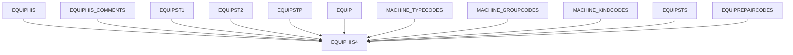
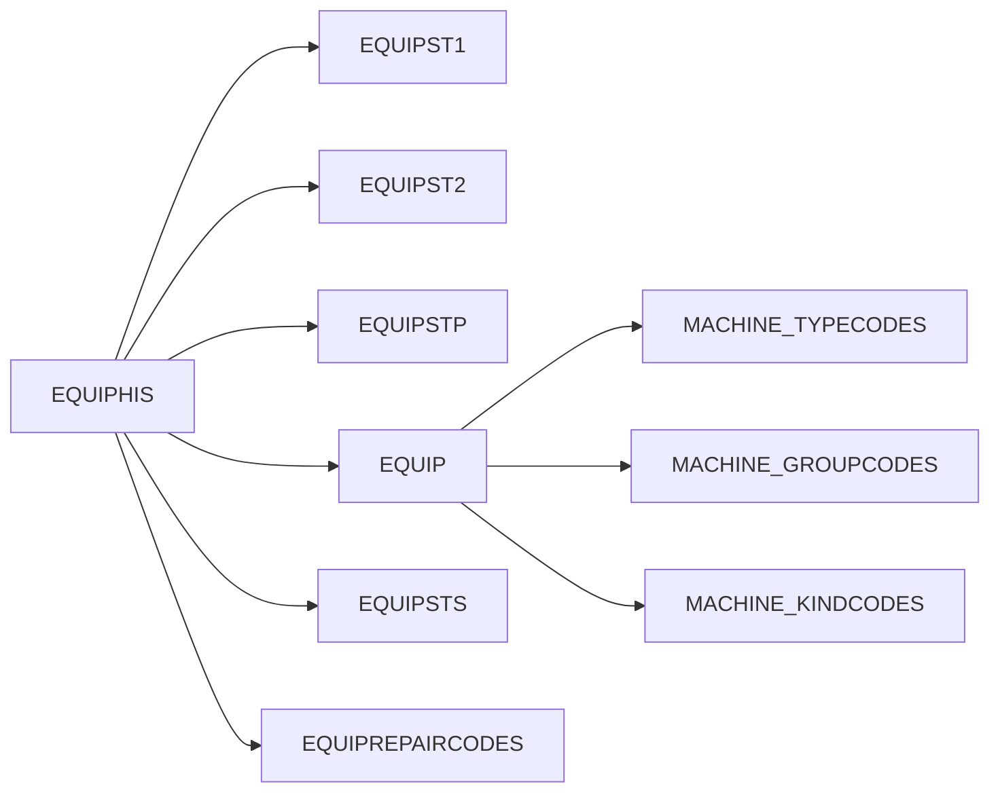
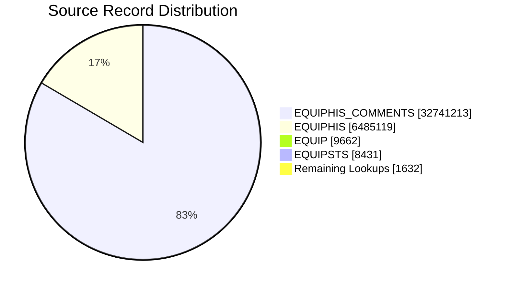

# 🚀 EQUIPHIS4 Fabric Migration Analysis Report

> **View Name (Production):** `dbo.EQUIPHIS4`
>
> **View Name (Fabric):** `MES_Analytics.EQUIPHIS4`
>
> **Analysis Date:** September 2026
>
> **Source Platform:** SQL Server Production
>
> **Target Platform:** Microsoft Fabric Lakehouse

---

# 📋 Executive Summary

The EQUIPHIS4 view is a consolidated equipment history reporting layer constructed from 11 source tables. The view combines transactional equipment history records, lookup information, equipment master data, machine classifications, maintenance metadata, repair code information, and operator comments into a single analytical dataset.

The Fabric implementation reproduces the same logical model and output structure as the Production implementation while sourcing data from the Fabric Lakehouse environment.

---

# 🏭 Production View Definition

```sql
CREATE VIEW [dbo].[EQUIPHIS4] (
  DATE_TIME_RUN,EMPID,MACHINE,MACHINE_DESCRIPTION
 ,MACHINE_GROUP,MACHINE_TYPE,MACHINE_KIND
 ,DATE_TIME,STATUS1_CODE,STATUS1_NAME,STATUS2_CODE,STATUS2_NAME
 ,PM_CODE,PM_NAME,REPAIR1_CODE,REPAIR1_NAME
 ,REPAIR2_CODE,REPAIR2_NAME,REPAIR3_CODE,REPAIR3_NAME
 ,IGNORE_RECORD,COMMENTS,USERNAME,COMMENTTYPE,LINEORDER
 ,MACHINE_PRIORITY,REPAIRCODE
) AS
SELECT
  HIS.DATE_TIME_RUN,HIS.EMPID,HIS.MACHINE,EQP.DESCRIPTION
 ,MG.MACHINE_GROUP, MT.MACHINE_TYPE, MK.MACHINE_KIND
 ,HIS.DATE_TIME,HIS.STATUS1_CODE,ST1.STATUS1_NAME,HIS.STATUS2_CODE,ST2.STATUS2_NAME
 ,HIS.PM_CODE,STP.PM_NAME
 ,NULL,NULL,NULL,NULL,NULL,NULL
 ,HIS.IGNORE_RECORD,'' AS COMMENTS
 ,HIS.USERNAME,'CS' AS COMMENTTYPE,1 AS LINEORDER
 ,STS.DOWN_PRIORITY AS MACHINE_PRIORITY
 ,RC.REPAIRCODE
  FROM dbo.EQUIPHIS HIS (NOLOCK)
       INNER JOIN dbo.EQUIPST1 ST1 (NOLOCK) ON (ST1.STATUS1_CODE=HIS.STATUS1_CODE)
       INNER JOIN dbo.EQUIPST2 ST2 (NOLOCK) ON (ST2.STATUS2_CODE=HIS.STATUS2_CODE)
       INNER JOIN dbo.EQUIPSTP STP (NOLOCK) ON (STP.PM_CODE=HIS.PM_CODE)
       INNER JOIN dbo.EQUIP EQP (NOLOCK) ON (EQP.MACHINE=HIS.MACHINE)
       LEFT JOIN dbo.MACHINE_TYPECODES MT (NOLOCK) ON MT.MachineTypeId = EQP.MachineTypeId
       LEFT JOIN dbo.MACHINE_GROUPCODES MG (NOLOCK) ON MG.MachineGroupId = EQP.MachineGroupId
       LEFT JOIN [dbo].[MACHINE_KINDCODES] MK (NOLOCK) ON MK.[MachineKindId] = EQP.[MachineKindId]
       INNER JOIN dbo.EQUIPSTS STS (NOLOCK) ON (STS.MACHINE=HIS.MACHINE)
       LEFT OUTER JOIN dbo.EQUIPREPAIRCODES RC (NOLOCK) ON (RC.RepairCodeId=HIS.RepairCodeId)
UNION ALL
SELECT
  EQC.DATE_TIME,NULL,EQC.MACHINE,EQP.DESCRIPTION
 ,MG.MACHINE_GROUP, MT.MACHINE_TYPE, MK.MACHINE_KIND
 ,EQC.DATE_TIME,NULL,NULL,NULL,NULL
 ,NULL,NULL
 ,NULL,NULL,NULL,NULL,NULL,NULL
 ,NULL
 ,EQC.COMMENTS,EQC.USERNAME,EQC.COMMENTTYPE,EQC.LINEORDER
 ,STS.DOWN_PRIORITY
 ,NULL
  FROM dbo.EQUIPHIS_COMMENTS EQC (NOLOCK)
       INNER JOIN dbo.EQUIP EQP (NOLOCK) ON (EQC.MACHINE=EQP.MACHINE)
       LEFT JOIN dbo.MACHINE_TYPECODES MT (NOLOCK) ON MT.MachineTypeId = EQP.MachineTypeId
       LEFT JOIN dbo.MACHINE_GROUPCODES MG (NOLOCK) ON MG.MachineGroupId = EQP.MachineGroupId
       LEFT JOIN [dbo].[MACHINE_KINDCODES] MK (NOLOCK) ON MK.[MachineKindId] = EQP.MachineKindId
       INNER JOIN dbo.EQUIPSTS STS (NOLOCK) ON (EQC.MACHINE=STS.MACHINE)
GO
```

---

# ☁️ Fabric View Definition

```sql
CREATE VIEW [MES_Analytics].[EQUIPHIS4] AS
SELECT
        HIS.DATE_TIME_RUN,
        HIS.EMPID,
        HIS.MACHINE,
        EQP.DESCRIPTION AS MACHINE_DESCRIPTION,
        MG.MACHINE_GROUP,
        MT.MACHINE_TYPE,
        MK.MACHINE_KIND,
        HIS.DATE_TIME,
        HIS.STATUS1_CODE,
        ST1.STATUS1_NAME,
        HIS.STATUS2_CODE,
        ST2.STATUS2_NAME,
        HIS.PM_CODE,
        STP.PM_NAME,
        NULL AS REPAIR1_CODE,
        NULL AS REPAIR1_NAME,
        NULL AS REPAIR2_CODE,
        NULL AS REPAIR2_NAME,
        NULL AS REPAIR3_CODE,
        NULL AS REPAIR3_NAME,
        HIS.IGNORE_RECORD,
        '' AS COMMENTS,
        HIS.USERNAME,
        'CS' AS COMMENTTYPE,
        1 AS LINEORDER,
        STS.DOWN_PRIORITY AS MACHINE_PRIORITY,
        RC.REPAIRCODE
    FROM [Polar_Lakehouse_POC].[VisionProd].[dbo.EQUIPHIS] HIS
    INNER JOIN [Polar_Lakehouse_POC].[VisionProd].[dbo.EQUIPST1] ST1
        ON ST1.STATUS1_CODE = HIS.STATUS1_CODE
    INNER JOIN [Polar_Lakehouse_POC].[VisionProd].[dbo.EQUIPST2] ST2
        ON ST2.STATUS2_CODE = HIS.STATUS2_CODE
    INNER JOIN [Polar_Lakehouse_POC].[VisionProd].[dbo.EQUIPSTP] STP
        ON STP.PM_CODE = HIS.PM_CODE
    INNER JOIN [Polar_Lakehouse_POC].[VisionProd].[dbo.EQUIP] EQP
        ON EQP.MACHINE = HIS.MACHINE
    LEFT JOIN [Polar_Lakehouse_POC].[VisionProd].[dbo.MACHINE_TYPECODES] MT
        ON MT.MachineTypeId = EQP.MachineTypeId
    LEFT JOIN [Polar_Lakehouse_POC].[VisionProd].[dbo.MACHINE_GROUPCODES] MG
        ON MG.MachineGroupId = EQP.MachineGroupId
    LEFT JOIN [Polar_Lakehouse_POC].[VisionProd].[dbo.MACHINE_KINDCODES] MK
        ON MK.MachineKindId = EQP.MachineKindId
    INNER JOIN [Polar_Lakehouse_POC].[VisionProd].[dbo.EQUIPSTS] STS
        ON STS.MACHINE = HIS.MACHINE
    LEFT JOIN [Polar_Lakehouse_POC].[VisionProd].[dbo.EQUIPREPAIRCODES] RC
        ON RC.RepairCodeId = HIS.RepairCodeId
    UNION ALL
    SELECT
        EQC.DATE_TIME,
        NULL AS EMPID,
        EQC.MACHINE,
        EQP.DESCRIPTION AS MACHINE_DESCRIPTION,
        MG.MACHINE_GROUP,
        MT.MACHINE_TYPE,
        MK.MACHINE_KIND,
        EQC.DATE_TIME,
        NULL AS STATUS1_CODE,
        NULL AS STATUS1_NAME,
        NULL AS STATUS2_CODE,
        NULL AS STATUS2_NAME,
        NULL AS PM_CODE,
        NULL AS PM_NAME,
        NULL AS REPAIR1_CODE,
        NULL AS REPAIR1_NAME,
        NULL AS REPAIR2_CODE,
        NULL AS REPAIR2_NAME,
        NULL AS REPAIR3_CODE,
        NULL AS REPAIR3_NAME,
        NULL AS IGNORE_RECORD,
        EQC.COMMENTS,
        EQC.USERNAME,
        EQC.COMMENTTYPE,
        EQC.LINEORDER,
        STS.DOWN_PRIORITY AS MACHINE_PRIORITY,
        NULL AS REPAIRCODE
    FROM [Polar_Lakehouse_POC].[VisionProd].[dbo.EQUIPHIS_COMMENTS] EQC
    INNER JOIN [Polar_Lakehouse_POC].[VisionProd].[dbo.EQUIP] EQP
        ON EQP.MACHINE = EQC.MACHINE
    LEFT JOIN [Polar_Lakehouse_POC].[VisionProd].[dbo.MACHINE_TYPECODES] MT
        ON MT.MachineTypeId = EQP.MachineTypeId
    LEFT JOIN [Polar_Lakehouse_POC].[VisionProd].[dbo.MACHINE_GROUPCODES] MG
        ON MG.MachineGroupId = EQP.MachineGroupId
    LEFT JOIN [Polar_Lakehouse_POC].[VisionProd].[dbo.MACHINE_KINDCODES] MK
        ON MK.MachineKindId = EQP.MachineKindId
    INNER JOIN [Polar_Lakehouse_POC].[VisionProd].[dbo.EQUIPSTS] STS
        ON STS.MACHINE = EQC.MACHINE;
```

# 🎯 High Level Data Flow



# 📊 Source Table Inventory

| Source Table | Row Count | Columns |
|---|---:|---:|
| [Polar_Lakehouse_POC].[VisionProd].[dbo.EQUIPHIS] | 6,485,119 | 11 |
| [Polar_Lakehouse_POC].[VisionProd].[dbo.EQUIPST1] | 54 | 24 |
| [Polar_Lakehouse_POC].[VisionProd].[dbo.EQUIPST2] | 42 | 4 |
| [Polar_Lakehouse_POC].[VisionProd].[dbo.EQUIPSTP] | 66 | 7 |
| [Polar_Lakehouse_POC].[VisionProd].[dbo.EQUIPREPAIRCODES] | 1,113 | 6 |
| [Polar_Lakehouse_POC].[VisionProd].[dbo.EQUIP] | 9,662 | 41 |
| [Polar_Lakehouse_POC].[VisionProd].[dbo.MACHINE_TYPECODES] | 253 | 4 |
| [Polar_Lakehouse_POC].[VisionProd].[dbo.MACHINE_GROUPCODES] | 93 | 4 |
| [Polar_Lakehouse_POC].[VisionProd].[dbo.MACHINE_KINDCODES] | 11 | 3 |
| [Polar_Lakehouse_POC].[VisionProd].[dbo.EQUIPSTS] | 8,431 | 25 |
| [Polar_Lakehouse_POC].[VisionProd].[dbo.EQUIPHIS_COMMENTS] | 32,741,213 | 7 |

# 📅 Date Analysis

| Observation | Value |
|---|---|
| DATE_TIME available in EQUIPHIS | Yes |
| DATE_TIME available in EQUIPHIS_COMMENTS | Yes |
| DATE_TIME_RUN available in EQUIPHIS | Yes |
| Latest DATE_TIME found in EQUIPHIS | 2026-09-02 14:35:20.220000 |

The view is strongly time-series oriented and maintains operational event chronology through DATE_TIME and DATE_TIME_RUN columns.

# 🔗 Table Relationship Diagram



# 🗺️ Production-to-Fabric Source Mapping

| Production Source | Fabric Source |
|---|---|
| dbo.EQUIPHIS | [Polar_Lakehouse_POC].[VisionProd].[dbo.EQUIPHIS] |
| dbo.EQUIPST1 | [Polar_Lakehouse_POC].[VisionProd].[dbo.EQUIPST1] |
| dbo.EQUIPST2 | [Polar_Lakehouse_POC].[VisionProd].[dbo.EQUIPST2] |
| dbo.EQUIPSTP | [Polar_Lakehouse_POC].[VisionProd].[dbo.EQUIPSTP] |
| dbo.EQUIPREPAIRCODES | [Polar_Lakehouse_POC].[VisionProd].[dbo.EQUIPREPAIRCODES] |
| dbo.EQUIP | [Polar_Lakehouse_POC].[VisionProd].[dbo.EQUIP] |
| dbo.MACHINE_TYPECODES | [Polar_Lakehouse_POC].[VisionProd].[dbo.MACHINE_TYPECODES] |
| dbo.MACHINE_GROUPCODES | [Polar_Lakehouse_POC].[VisionProd].[dbo.MACHINE_GROUPCODES] |
| dbo.MACHINE_KINDCODES | [Polar_Lakehouse_POC].[VisionProd].[dbo.MACHINE_KINDCODES] |
| dbo.EQUIPSTS | [Polar_Lakehouse_POC].[VisionProd].[dbo.EQUIPSTS] |
| dbo.EQUIPHIS_COMMENTS | [Polar_Lakehouse_POC].[VisionProd].[dbo.EQUIPHIS_COMMENTS] |

# 📦 Output Column Mapping

| Production Column | Fabric Column |
|---|---|
| DATE_TIME_RUN | DATE_TIME_RUN |
| EMPID | EMPID |
| MACHINE | MACHINE |
| MACHINE_DESCRIPTION | MACHINE_DESCRIPTION |
| MACHINE_GROUP | MACHINE_GROUP |
| MACHINE_TYPE | MACHINE_TYPE |
| MACHINE_KIND | MACHINE_KIND |
| DATE_TIME | DATE_TIME |
| STATUS1_CODE | STATUS1_CODE |
| STATUS1_NAME | STATUS1_NAME |
| STATUS2_CODE | STATUS2_CODE |
| STATUS2_NAME | STATUS2_NAME |
| PM_CODE | PM_CODE |
| PM_NAME | PM_NAME |
| REPAIR1_CODE | REPAIR1_CODE |
| REPAIR1_NAME | REPAIR1_NAME |
| REPAIR2_CODE | REPAIR2_CODE |
| REPAIR2_NAME | REPAIR2_NAME |
| REPAIR3_CODE | REPAIR3_CODE |
| REPAIR3_NAME | REPAIR3_NAME |
| IGNORE_RECORD | IGNORE_RECORD |
| COMMENTS | COMMENTS |
| USERNAME | USERNAME |
| COMMENTTYPE | COMMENTTYPE |
| LINEORDER | LINEORDER |
| MACHINE_PRIORITY | MACHINE_PRIORITY |
| REPAIRCODE | REPAIRCODE |

# 📈 Volume Distribution


# EQUIPHIS4 Fabric Migration Analysis Report (Updated)

## Additional Validation Results Added

### View Counts

```sql
SELECT COUNT(*) FROM MES_Analytics.EQUIPHIS4;
-- 39,165,843

SELECT COUNT(*) FROM dbo.EQUIPHIS4;
-- 39,464,412
```

| View | Record Count |
|------|-------------:|
| MES_Analytics.EQUIPHIS4 | 39,165,843 |
| dbo.EQUIPHIS4 | 39,464,412 |
| Difference (Production - Fabric) | 298,569 |

### View Locations

**Fabric View**

```text
Schema : MES_Analytics
View   : EQUIPHIS4
```

**Production View**

```text
Lakehouse : Polar_Lakehouse_POC
Schema    : VisionProd
View      : dbo.EQUIPHIS4
```

### Production Date Validation

```sql
SELECT MAX(DATE_TIME) FROM dbo.EQUIPHIS4;
-- 3999-12-31 23:59:59.000
```

---

## Updated Production Source Table Statistics

| Production Table | Record Count |
|---|---:|
| dbo.EQUIPHIS | 6,522,542 |
| dbo.EQUIPST1 | 54 |
| dbo.EQUIPST2 | 42 |
| dbo.EQUIPSTP | 66 |
| dbo.EQUIPREPAIRCODES | 1,315 |
| dbo.EQUIP | 9,676 |
| dbo.MACHINE_TYPECODES | 255 |
| dbo.MACHINE_GROUPCODES | 93 |
| dbo.MACHINE_KINDCODES | 11 |
| dbo.EQUIPSTS | 8,445 |
| dbo.EQUIPHIS_COMMENTS | 33,002,208 |

## Analysis Notes

- Production view contains 39,464,412 rows.
- Fabric view contains 39,165,843 rows.
- Observed difference between environments is 298,569 rows.
- Production view maximum DATE_TIME is 3999-12-31 23:59:59.000, indicating the dataset contains future sentinel/default date values in addition to operational timestamps.
- EQUIPHIS_COMMENTS remains the largest contributing source table.
- Combined production source footprint exceeds 39 million records.
- EQUIPHIS and EQUIPHIS_COMMENTS together account for the overwhelming majority of rows contributing to the final view.

## Existing report enhancement

This section is intended to be appended to the previously generated report and supersedes earlier row-count observations where newer counts are available.

# 🔍 Analytical Observations

1. EQUIPHIS_COMMENTS is the dominant source table by volume and contributes the majority of records entering the UNION ALL operation.
2. EQUIPHIS provides the core transactional equipment history component.
3. EQUIP acts as the central dimensional table supplying equipment descriptions and machine classification identifiers.
4. MACHINE_TYPECODES, MACHINE_GROUPCODES and MACHINE_KINDCODES enrich operational records with hierarchy metadata.
5. EQUIPST1, EQUIPST2 and EQUIPSTP serve as compact lookup dimensions translating operational codes into business-friendly descriptions.
6. EQUIPSTS supplies current machine priority information through DOWN_PRIORITY.
7. EQUIPREPAIRCODES provides repair code enrichment for transactional history records.
8. Historical event records and free-form operational comments are unified through a UNION ALL strategy.
9. The latest observed operational timestamp in the supplied analysis is 2026-09-02 14:35:20.220000.
10. The overall source footprint exceeds 39 million records across participating datasets.

# ✅ Conclusion

EQUIPHIS4 represents a consolidated equipment history and comment reporting layer built from 11 Fabric source tables. The Fabric implementation preserves the full logical structure, lookup enrichment strategy, hierarchy relationships, repair-code associations, operational timestamps, maintenance metadata, and comment history represented in the Production implementation.
