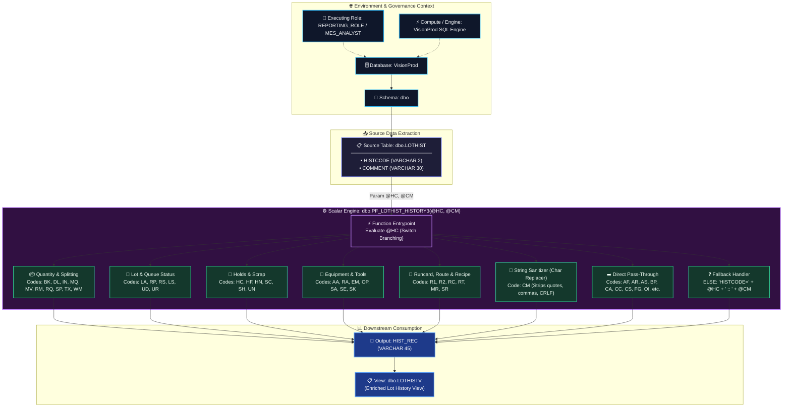
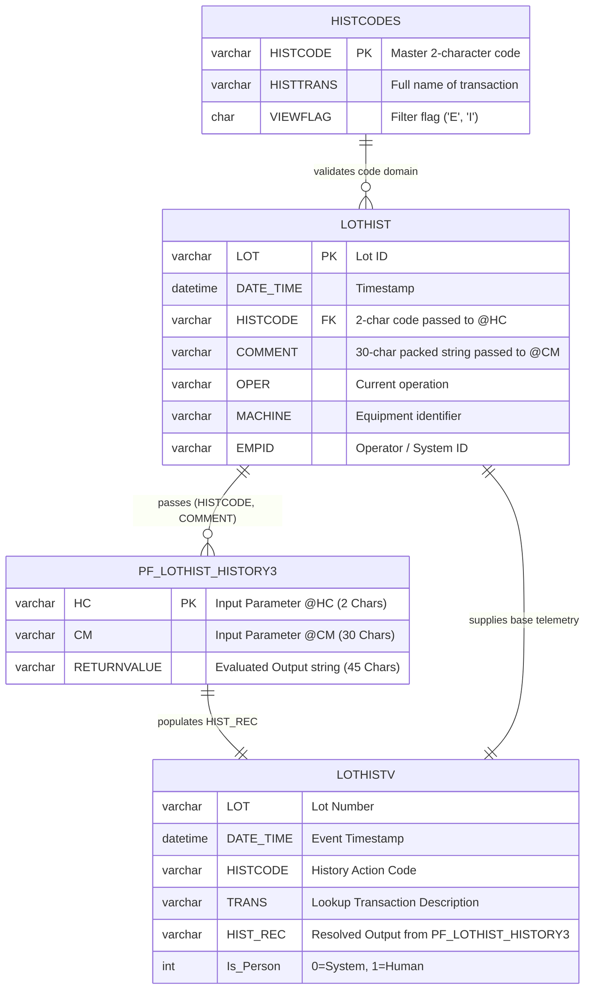

# ⚙️ Database Function Documentation: `dbo.PF_LOTHIST_HISTORY3`

> **Source System:** `VisionProd` &nbsp;|&nbsp; **Object Type:** `Scalar User-Defined Function (UDF)` &nbsp;|&nbsp; **Parent View:** [`dbo.LOTHISTV`](file:///c:/Users/neelmanir/OneDrive%20-%20USEReady%20Technology%20Private%20Limited/Desktop/PolarSemiConductor/view1.md) &nbsp;|&nbsp; **Domain:** MES Lot History Parsing Engine

---

## 📑 Table of Contents
1. [SQL Function Definition](#-sql-function-definition)
2. [Environment & Object Metadata](#-environment--object-metadata)
3. [Architecture & Execution Flowchart](#-architecture--execution-flowchart)
4. [Entity Relationship & Interaction (ER) Diagram](#-entity-relationship--interaction-er-diagram)
5. [HistCode Decoding & Transformation Matrix](#-histcode-decoding--transformation-matrix)
6. [Core Positional Parsing & Business Rules](#-core-positional-parsing--business-rules)
7. [Performance & Optimization Analysis](#-performance--optimization-analysis)

---

## 💻 SQL Function Definition

```sql
-- 2021-11-09  mqb:  Add FG histcode.
-- 2020-09-09  cbd:  Added the OI histcode option.
CREATE FUNCTION [dbo].[PF_LOTHIST_HISTORY3] (
    @HC VARCHAR(2),
    @CM VARCHAR(30)
)
RETURNS VARCHAR(45) AS
BEGIN
    DECLARE @RETURNVALUE VARCHAR(45);
    SET @RETURNVALUE =
    CASE @HC
        WHEN 'AA' THEN CASE WHEN SUBSTRING(@CM,16,10)=' ' THEN 'ALIGNER:'+LEFT(@CM,10) ELSE 'NEW ALIGNER:'+LEFT(@CM,10)+'  OLD:'+SUBSTRING(@CM,16,10) END
        WHEN 'AF' THEN @CM
        WHEN 'AR' THEN @CM
        WHEN 'AS' THEN @CM
        WHEN 'BK' THEN 'QTY:'+SUBSTRING(@CM,17,3)+'  FROM:'+SUBSTRING(@CM,7,10)+'  TO:'+SUBSTRING(@CM,20,10)
        WHEN 'BP' THEN @CM
        WHEN 'CA' THEN @CM
        WHEN 'CC' THEN @CM
        WHEN 'CL' THEN CASE WHEN SUBSTRING(@CM,16,5)=' ' THEN 'CLIP OPER:'+LEFT(@CM,5) ELSE 'NEW CLIP OPER:'+LEFT(@CM,5)+'  OLD:'+SUBSTRING(@CM,16,5) END
        WHEN 'CM' THEN REPLACE(REPLACE(REPLACE(REPLACE(REPLACE(@CM,CHAR(44),' '),CHAR(34),' '),CHAR(39),' '),CHAR(10),' '),CHAR(13),' ')
        WHEN 'CR' THEN 'QTY:'+LEFT(@CM,3)+' SCRIBED:'+SUBSTRING(@CM,5,10)
        WHEN 'CS' THEN @CM
        WHEN 'CT' THEN @CM
        WHEN 'CV' THEN @CM
        WHEN 'CW' THEN @CM
        WHEN 'DD' THEN CASE WHEN SUBSTRING(@CM,16,8)=' ' THEN 'DUEDATE:'+LEFT(@CM,8) ELSE 'NEW DUEDATE:'+LEFT(@CM,8)+'  OLD:'+SUBSTRING(@CM,16,8) END
        WHEN 'DK' THEN CASE WHEN SUBSTRING(@CM,16,10)=' ' THEN 'DEKIT WFR:'+LEFT(@CM,10) ELSE 'DEKIT FROM LOT:'+SUBSTRING(@CM,16,10) END
        WHEN 'DL' THEN 'QTY:'+LEFT(@CM,3)
        WHEN 'EC' THEN CASE WHEN SUBSTRING(@CM,16,6)=' ' THEN 'ESTIMATED COST:'+LEFT(@CM,6) ELSE 'NEW ESTIMATED COST:'+LEFT(@CM,6)+'  OLD:'+SUBSTRING(@CM,16,6) END
        WHEN 'EM' THEN 'EVNT MCH:'+@CM
        WHEN 'EN' THEN 'EVNT NAM:'+@CM
        WHEN 'ER' THEN 'EDC REQUIRED FLAG:'+LEFT(@CM,3)
        WHEN 'ES' THEN 'ENG SPLIT:'+LEFT(@CM,3)
        WHEN 'FG' THEN @CM
        WHEN 'FH' THEN @CM
        WHEN 'FM' THEN 'PRODUCT FAMILY:'+LEFT(@CM,18)

        WHEN 'HC' THEN
            CASE
                WHEN LEFT(@CM,6)<>' ' AND SUBSTRING(@CM,16,6)<>' ' THEN 'NEW HOLD CODE:'+LEFT(@CM,6)+'  OLD:'+SUBSTRING(@CM,16,6)
                WHEN SUBSTRING(@CM,16,6)<>' ' THEN 'OFF HOLD CODE:'+SUBSTRING(@CM,16,6)
                WHEN LEFT(@CM,6)<>' '  THEN 'ON HOLD CODE:'+LEFT(@CM,6)
                ELSE ''
            END

        WHEN 'HF' THEN 'OFF HOLD CODE:'+SUBSTRING(@CM,16,6)
        WHEN 'HN' THEN CASE WHEN SUBSTRING(@CM,16,6)=' ' THEN 'NEW HOLD CODE:'+LEFT(@CM,6) ELSE 'NEW HOLD CODE:'+LEFT(@CM,6)+'  OLD:'+SUBSTRING(@CM,16,6) END
        WHEN 'HT' THEN 'HOTFLAG= '+LEFT(@CM,1)+'  OLD= '+SUBSTRING(@CM,16,1)
        WHEN 'IL' THEN @CM
        WHEN 'IN' THEN 'QTY:'+LEFT(@CM,3)
        WHEN 'KL' THEN 'LOT:'+LEFT(@CM,10)+' SLOT:'+SUBSTRING(@CM,11,2)+' PRT:'+SUBSTRING(@CM,13,18)
        WHEN 'KT' THEN CASE WHEN SUBSTRING(@CM,16,10)=' ' THEN 'KIT INTO LOT:'+LEFT(@CM,10) ELSE 'KIT FROM LOT:'+SUBSTRING(@CM,16,10) END
        WHEN 'KW' THEN 'WFR:'+LEFT(@CM,10)+' SLOT:'+SUBSTRING(@CM,11,2)+' PRT:'+SUBSTRING(@CM,13,18)

        WHEN 'LA' THEN
            CASE
                WHEN SUBSTRING(@CM,4,1)=' ' THEN 'QTY:'+LEFT(@CM,3)
                WHEN SUBSTRING(@CM,4,1)='U' THEN 'QTY:'+LEFT(@CM,3)+' NEW= U :: IN TRANSIT    OLD= '+SUBSTRING(@CM,5,1)
                WHEN SUBSTRING(@CM,4,1)='Q' THEN 'QTY:'+LEFT(@CM,3)+' NEW= Q :: IN QUEUE      OLD= '+SUBSTRING(@CM,5,1)
                WHEN SUBSTRING(@CM,4,1)='R' THEN 'QTY:'+LEFT(@CM,3)+' NEW= R :: REQUESTED     OLD= '+SUBSTRING(@CM,5,1)
                WHEN SUBSTRING(@CM,4,1)='D' THEN 'QTY:'+LEFT(@CM,3)+' NEW= D :: DISPATCHED    OLD= '+SUBSTRING(@CM,5,1)
                WHEN SUBSTRING(@CM,4,1)='T' THEN 'QTY:'+LEFT(@CM,3)+' NEW= T :: TRANSITION    OLD= '+SUBSTRING(@CM,5,1)
                WHEN SUBSTRING(@CM,4,1)='I' THEN 'QTY:'+LEFT(@CM,3)+' NEW= I :: IN MACHQUE    OLD= '+SUBSTRING(@CM,5,1)
                WHEN SUBSTRING(@CM,4,1)='P' THEN 'QTY:'+LEFT(@CM,3)+' NEW= P :: IN PROCESS    OLD= '+SUBSTRING(@CM,5,1)
                WHEN SUBSTRING(@CM,4,1)='W' THEN 'QTY:'+LEFT(@CM,3)+' NEW= W :: WAIT AUTOEDC  OLD= '+SUBSTRING(@CM,5,1)
                WHEN SUBSTRING(@CM,4,1)='M' THEN 'QTY:'+LEFT(@CM,3)+' NEW= M :: WAIT MOVEOUT  OLD= '+SUBSTRING(@CM,5,1)
                WHEN SUBSTRING(@CM,4,1)='A' THEN 'QTY:'+LEFT(@CM,3)+' NEW= A :: WAIT MOVEOUT  OLD= '+SUBSTRING(@CM,5,1)
                ELSE 'QTY:'+LEFT(@CM,3)+' NEW STATUS= '+SUBSTRING(@CM,4,1)+'  OLD= '+SUBSTRING(@CM,5,1)
            END

        WHEN 'LB' THEN 'VND:'+LEFT(@CM,10)+' LOT:'+SUBSTRING(@CM,16,14)

        WHEN 'LC' THEN
            CASE
                WHEN SUBSTRING(@CM,16,14)=' ' THEN 'QTY:'+LEFT(@CM,3)
                ELSE 'QTY:'+LEFT(@CM,3)+' BIN:'+SUBSTRING(@CM,16,14)
            END

        WHEN 'LL' THEN @CM
        WHEN 'LN' THEN @CM
        WHEN 'LR' THEN 'LOT REVIEW FLAG:'+LEFT(@CM,3)

        WHEN 'LS' THEN
            CASE
                WHEN LEFT(@CM,1)='O' THEN 'NEW LOT STATUS= O :: OPEN          OLD= '+SUBSTRING(@CM,16,1)
                WHEN LEFT(@CM,1)='M' THEN 'NEW LOT STATUS= M :: CLOSE TO MFG  OLD= '+SUBSTRING(@CM,16,1)
                WHEN LEFT(@CM,1)='A' THEN 'NEW LOT STATUS= A :: CLOSE TO ACC  OLD= '+SUBSTRING(@CM,16,1)
                WHEN LEFT(@CM,1)='X' THEN 'NEW LOT STATUS= X :: ARCHIVED      OLD= '+SUBSTRING(@CM,16,1)
                ELSE 'NEW LOT STATUS= '+LEFT(@CM,1)+'  OLD= '+SUBSTRING(@CM,16,1)
            END

        WHEN 'MM' THEN @CM
        WHEN 'MQ' THEN 'NEW QTY:'+LEFT(@CM,3)
        WHEN 'MV' THEN CASE WHEN SUBSTRING(@CM,4,4)<>' ' THEN 'QTY:'+LEFT(@CM,3)+'  Place:'+SUBSTRING(@CM,4,4)+'  Total:'+SUBSTRING(@CM,8,4)+'  Mode:'+SUBSTRING(@CM,12,3) ELSE 'QTY:'+LEFT(@CM,3) END

        WHEN 'MR' THEN
            CASE
                WHEN SUBSTRING(@CM,15,1)='A' THEN 'ADD LVL:'+LEFT(@CM,3)+'  MSK:'+SUBSTRING(@CM,4,8)+'  REV:'+SUBSTRING(@CM,12,2)+' SET:'+SUBSTRING(@CM,14,1)
                WHEN SUBSTRING(@CM,15,1)='C' THEN 'CHG LVL:'+LEFT(@CM,3)+' NEW:'+SUBSTRING(@CM,4,8)+'-'+SUBSTRING(@CM,12,3)+' OLD:'+SUBSTRING(@CM,19,8)+'-'+SUBSTRING(@CM,27,3)
                WHEN SUBSTRING(@CM,15,1)='D' THEN 'DEL LVL:'+LEFT(@CM,3)+'  MSK:'+SUBSTRING(@CM,4,8)+'  REV:'+SUBSTRING(@CM,12,2)+' SET:'+SUBSTRING(@CM,14,1)
                ELSE 'NEW:'+LEFT(@CM,14)+' OLD:'+SUBSTRING(@CM,16,14)
            END

        WHEN 'OC' THEN @CM
        WHEN 'OI' THEN @CM
        WHEN 'OP' THEN 'QTY:'+SUBSTRING(@CM,22,3)+'  NEW OPER:'+LEFT(@CM,5)+'  OLD OPER:'+SUBSTRING(@CM,16,5)
        WHEN 'OW' THEN CASE WHEN SUBSTRING(@CM,16,7)=' ' THEN 'OWNER:'+LEFT(@CM,7) ELSE 'NEW OWNER:'+LEFT(@CM,7)+'  OLD:'+SUBSTRING(@CM,16,7) END
        WHEN 'P1' THEN '1ST PARAMETRIC FLAG:'+LEFT(@CM,4)
        WHEN 'PD' THEN @CM
        WHEN 'PJ' THEN CASE WHEN SUBSTRING(@CM,16,10)=' ' THEN 'NEW PROJECT:'+LEFT(@CM,10) ELSE 'NEW PROJECT:'+LEFT(@CM,10)+'  OLD:'+SUBSTRING(@CM,16,10) END
        WHEN 'PL' THEN CASE WHEN LEFT(@CM,3)='ON' THEN 'PQL FLAG:ON' WHEN LEFT(@CM,3)='OFF' THEN 'PQL FLAG:OFF' ELSE @CM END
        WHEN 'PM' THEN 'PARM:'+LEFT(@CM,20)+' VAL:'+SUBSTRING(@CM,21,10)
        WHEN 'PS' THEN @CM
        WHEN 'PT' THEN CASE WHEN LEFT(@CM,3)=' ' THEN 'PART:'+SUBSTRING(@CM,6,18) ELSE LEFT(@CM,3)+' PART:'+SUBSTRING(@CM,6,18) END
        
        WHEN 'QD' THEN 'QDESC:  '+@CM
        WHEN 'QE' THEN
            CASE
                WHEN LEFT(@CM,15)<>' ' THEN 'ADD:    '+LEFT(@CM,15)
                WHEN SUBSTRING(@CM,16,15)<>' ' THEN 'REMOVE: '+SUBSTRING(@CM,16,15)
                ELSE @CM
            END
        WHEN 'QI' THEN
            CASE
                WHEN LEFT(@CM,11)<>' ' THEN 'ADD:    '+LEFT(@CM,11)
                WHEN SUBSTRING(@CM,16,11)<>' ' THEN 'REMOVE: '+SUBSTRING(@CM,16,11)
                ELSE @CM
            END

        WHEN 'QT' THEN CASE WHEN SUBSTRING(@CM,16,3)=' ' THEN 'QTY:'+LEFT(@CM,3) ELSE 'NEW QTY:'+LEFT(@CM,3)+'  OLD QTY:'+SUBSTRING(@CM,16,3) END
        WHEN 'R1' THEN CASE WHEN SUBSTRING(@CM,16,10)=' ' THEN 'ROUTE:'+LEFT(@CM,10) ELSE 'NEW ROUTE:'+LEFT(@CM,10)+'  OLD:'+SUBSTRING(@CM,16,10) END
        WHEN 'R2' THEN CASE WHEN SUBSTRING(@CM,16,10)=' ' THEN 'ROUTE:'+LEFT(@CM,10) ELSE 'NEW ROUTE:'+LEFT(@CM,10)+'  OLD:'+SUBSTRING(@CM,16,10) END
        WHEN 'RA' THEN CASE WHEN SUBSTRING(@CM,16,10)=' ' THEN 'RESTRICTED ALIGNER:'+LEFT(@CM,10) ELSE 'NEW RESTRICT ALGNR:'+LEFT(@CM,10)+'  OLD:'+SUBSTRING(@CM,16,10) END
        WHEN 'RB' THEN 'REQBY TIME: '+@CM
        WHEN 'RC' THEN CASE WHEN SUBSTRING(@CM,16,12)=' ' THEN 'NEW RUNCARD:'+LEFT(@CM,12) ELSE 'NEW RUNCARD:'+LEFT(@CM,12)+'   OLD:'+SUBSTRING(@CM,16,12) END
        WHEN 'RE' THEN 'ENGINEER:'+LEFT(@CM,20)
        WHEN 'RH' THEN 'REQBY HOURS:'+@CM
        WHEN 'RL' THEN 'Repurpose '+RTRIM(LEFT(@CM,10))+' from MDS #'+RTRIM(SUBSTRING(@CM,16,10))
        WHEN 'RM' THEN CASE WHEN SUBSTRING(@CM,4,4)<>' ' THEN 'QTY:'+LEFT(@CM,3)+'  Place:'+SUBSTRING(@CM,4,4)+'  Total:'+SUBSTRING(@CM,8,4)+'  Mode:'+SUBSTRING(@CM,12,3) ELSE 'QTY:'+LEFT(@CM,3) END

        WHEN 'RP' THEN
            CASE
                WHEN SUBSTRING(@CM,4,1)='U' THEN 'QTY:'+LEFT(@CM,3)+' NEW= U :: IN TRANSIT    OLD= '+SUBSTRING(@CM,5,1)
                WHEN SUBSTRING(@CM,4,1)='Q' THEN 'QTY:'+LEFT(@CM,3)+' NEW= Q :: IN QUEUE      OLD= '+SUBSTRING(@CM,5,1)
                WHEN SUBSTRING(@CM,4,1)='R' THEN 'QTY:'+LEFT(@CM,3)+' NEW= R :: REQUESTED     OLD= '+SUBSTRING(@CM,5,1)
                WHEN SUBSTRING(@CM,4,1)='D' THEN 'QTY:'+LEFT(@CM,3)+' NEW= D :: DISPATCHED    OLD= '+SUBSTRING(@CM,5,1)
                WHEN SUBSTRING(@CM,4,1)='T' THEN 'QTY:'+LEFT(@CM,3)+' NEW= T :: TRANSITION    OLD= '+SUBSTRING(@CM,5,1)
                WHEN SUBSTRING(@CM,4,1)='I' THEN 'QTY:'+LEFT(@CM,3)+' NEW= I :: IN MACHQUE    OLD= '+SUBSTRING(@CM,5,1)
                WHEN SUBSTRING(@CM,4,1)='P' THEN 'QTY:'+LEFT(@CM,3)+' NEW= P :: IN PROCESS    OLD= '+SUBSTRING(@CM,5,1)
                WHEN SUBSTRING(@CM,4,1)='W' THEN 'QTY:'+LEFT(@CM,3)+' NEW= W :: WAIT AUTOEDC  OLD= '+SUBSTRING(@CM,5,1)
                WHEN SUBSTRING(@CM,4,1)='M' THEN 'QTY:'+LEFT(@CM,3)+' NEW= M :: WAIT MOVEOUT  OLD= '+SUBSTRING(@CM,5,1)
                WHEN SUBSTRING(@CM,4,1)='A' THEN 'QTY:'+LEFT(@CM,3)+' NEW= A :: WAIT MOVEOUT  OLD= '+SUBSTRING(@CM,5,1)
                ELSE 'QTY:'+LEFT(@CM,3)+' NEW STATUS= '+SUBSTRING(@CM,4,1)+'  OLD= '+SUBSTRING(@CM,5,1)
            END

        WHEN 'RQ' THEN 'QTY:'+LEFT(@CM,3)
        WHEN 'RR' THEN @CM

        WHEN 'RS' THEN
            CASE
                WHEN SUBSTRING(@CM,4,1)='U' THEN 'QTY:'+LEFT(@CM,3)+' NEW= U :: IN TRANSIT    OLD= '+SUBSTRING(@CM,5,1)
                WHEN SUBSTRING(@CM,4,1)='Q' THEN 'QTY:'+LEFT(@CM,3)+' NEW= Q :: IN QUEUE      OLD= '+SUBSTRING(@CM,5,1)
                WHEN SUBSTRING(@CM,4,1)='R' THEN 'QTY:'+LEFT(@CM,3)+' NEW= R :: REQUESTED     OLD= '+SUBSTRING(@CM,5,1)
                WHEN SUBSTRING(@CM,4,1)='D' THEN 'QTY:'+LEFT(@CM,3)+' NEW= D :: DISPATCHED    OLD= '+SUBSTRING(@CM,5,1)
                WHEN SUBSTRING(@CM,4,1)='T' THEN 'QTY:'+LEFT(@CM,3)+' NEW= T :: TRANSITION    OLD= '+SUBSTRING(@CM,5,1)
                WHEN SUBSTRING(@CM,4,1)='I' THEN 'QTY:'+LEFT(@CM,3)+' NEW= I :: IN MACHQUE    OLD= '+SUBSTRING(@CM,5,1)
                WHEN SUBSTRING(@CM,4,1)='P' THEN 'QTY:'+LEFT(@CM,3)+' NEW= P :: IN PROCESS    OLD= '+SUBSTRING(@CM,5,1)
                WHEN SUBSTRING(@CM,4,1)='W' THEN 'QTY:'+LEFT(@CM,3)+' NEW= W :: WAIT AUTOEDC  OLD= '+SUBSTRING(@CM,5,1)
                WHEN SUBSTRING(@CM,4,1)='M' THEN 'QTY:'+LEFT(@CM,3)+' NEW= M :: WAIT MOVEOUT  OLD= '+SUBSTRING(@CM,5,1)
                WHEN SUBSTRING(@CM,4,1)='A' THEN 'QTY:'+LEFT(@CM,3)+' NEW= A :: WAIT MOVEOUT  OLD= '+SUBSTRING(@CM,5,1)
                ELSE 'QTY:'+LEFT(@CM,3)+' NEW STATUS= '+SUBSTRING(@CM,4,1)+'  OLD= '+SUBSTRING(@CM,5,1)
            END

        WHEN 'RT' THEN CASE WHEN SUBSTRING(@CM,16,10)=' ' THEN 'ROUTE:'+LEFT(@CM,10) ELSE 'NEW ROUTE:'+LEFT(@CM,10)+'  OLD:'+SUBSTRING(@CM,16,10) END
        WHEN 'RW' THEN 'QTY:'+LEFT(@CM,3)+' TO OPER:'+SUBSTRING(@CM,12,5)+'  REASON:'+SUBSTRING(@CM,5,6)
        WHEN 'SA' THEN 'QTY:'+SUBSTRING(@CM,22,3)+'  NEW OPER:'+LEFT(@CM,5)+'  OLD OPER:'+SUBSTRING(@CM,16,5)
        WHEN 'SB' THEN @CM
        WHEN 'SC' THEN 'SCRAP:'+SUBSTRING(@CM,5,3)+':'+SUBSTRING(@CM,9,6)
        WHEN 'SE' THEN 'QTY:'+SUBSTRING(@CM,22,3)+'  NEW OPER:'+LEFT(@CM,5)+'  OLD OPER:'+SUBSTRING(@CM,16,5)
        WHEN 'SH' THEN CASE WHEN SUBSTRING(@CM,9,6)=' ' THEN 'QTY:'+LEFT(@CM,3)+' SHOT:'+SUBSTRING(@CM,19,6)+' LOC:'+SUBSTRING(@CM,16,2) ELSE 'QTY:'+LEFT(@CM,3)+' SHOT:'+SUBSTRING(@CM,19,6)+' LOC:'+SUBSTRING(@CM,16,2)+' SCRAP:'+SUBSTRING(@CM,5,3)+':'+SUBSTRING(@CM,9,6) END
        WHEN 'SK' THEN 'QTY:'+SUBSTRING(@CM,22,3)+'  NEW OPER:'+LEFT(@CM,5)+'  OLD OPER:'+SUBSTRING(@CM,16,5)
        WHEN 'SL' THEN @CM
        WHEN 'SM' THEN @CM
        WHEN 'SO' THEN CASE WHEN SUBSTRING(@CM,16,10)=' ' THEN 'SALES ORDER:'+LEFT(@CM,10)+' LINE:'+SUBSTRING(@CM,11,5) ELSE 'NEW:'+LEFT(@CM,10)+' L:'+SUBSTRING(@CM,11,5)+' OLD:'+SUBSTRING(@CM,16,10)+' L:'+SUBSTRING(@CM,26,5) END
        WHEN 'SP' THEN 'QTY:'+SUBSTRING(@CM,17,3)+'  FROM:'+SUBSTRING(@CM,7,10)+'  TO:'+SUBSTRING(@CM,20,10)
        WHEN 'SR' THEN 'ROM RECIP '+@CM
        WHEN 'TC' THEN 'TENCOR STAT:'+LEFT(@CM,3)
        WHEN 'TN' THEN 'NEW TARGET PART:'+LEFT(@CM,18)
        WHEN 'TO' THEN 'OLD TARGET PART:'+LEFT(@CM,18)
        WHEN 'TR' THEN 'COLR:'+LEFT(@CM,10)+' ENG:'+SUBSTRING(@CM,11,20)
        WHEN 'TX' THEN 'QTY:'+LEFT(@CM,3)+' '+SUBSTRING(@CM,4,27)

        WHEN 'UD' THEN
            CASE
                WHEN SUBSTRING(@CM,1,1)='Q' THEN +' NEW= Q :: IN QUEUE      OLD= '+SUBSTRING(@CM,2,1)
                WHEN SUBSTRING(@CM,1,1)='R' THEN +' NEW= R :: REQUESTED     OLD= '+SUBSTRING(@CM,2,1)
                ELSE 'NEW STATUS= '+SUBSTRING(@CM,1,1)+'  OLD= '+SUBSTRING(@CM,2,1)
            END

        WHEN 'UN' THEN 'QTY:'+LEFT(@CM,3)+' SCRAPCODE:'+SUBSTRING(@CM,5,6)
        WHEN 'UR' THEN 'NEW= Q :: IN QUEUE      OLD= '+@CM
        WHEN 'UX' THEN @CM
        WHEN 'V1' THEN @CM
        WHEN 'V2' THEN @CM
        WHEN 'VA' THEN CASE WHEN SUBSTRING(@CM,16,6)=' ' THEN 'NEW VALUEADDED:'+LEFT(@CM,6) ELSE 'NEW VALUEADDED:'+LEFT(@CM,6)+'  OLD:'+SUBSTRING(@CM,16,6) END
        WHEN 'VL' THEN 'VQL FLAG:'+LEFT(@CM,3)
        WHEN 'WF' THEN 'RAW WAFER NUMBER:'+SUBSTRING(@CM,5,18)
        WHEN 'WM' THEN 'QTY:'+LEFT(@CM,3)
        WHEN 'WR' THEN CASE WHEN SUBSTRING(@CM,16,6)=' ' THEN 'WORK REQUEST:'+LEFT(@CM,6) ELSE 'NEW WORK REQUEST:'+LEFT(@CM,6)+' OLD:'+SUBSTRING(@CM,16,6) END

        ELSE 'HISTCODE='+@HC+' :: '+@CM
    END
    RETURN @RETURNVALUE
END
GO
```

---

## 🏛️ Environment & Object Metadata

| Property | Value / Target | Description |
| :--- | :--- | :--- |
| **Database** | `VisionProd` | Polar Semiconductor Manufacturing Execution Database |
| **Schema** | `dbo` | Core Database Object Schema |
| **Function Name** | `[dbo].[PF_LOTHIST_HISTORY3]` | Historical Lot Comment String Parser |
| **Role / Permissions** | `EXECUTE` grant to `MES_ANALYST`, `DATA_CONSUMER_READ`, `REPORTING_ROLE` | Accessible by reporting layer and dependent views |
| **Warehouse / Engine** | SQL Server Compute / Analytical Engine | Row-by-row scalar evaluation engine |
| **Input Parameter 1** | `@HC VARCHAR(2)` | 2-character transactional History Code (e.g. `HC`, `LA`, `BK`) |
| **Input Parameter 2** | `@CM VARCHAR(30)` | Up to 30-character packed positional comment payload |
| **Return Type** | `VARCHAR(45)` | Formatted, user-friendly audit narrative |
| **Direct Consumers** | View: [`dbo.LOTHISTV`](file:///c:/Users/neelmanir/OneDrive%20-%20USEReady%20Technology%20Private%20Limited/Desktop/PolarSemiConductor/view1.md) (Column: `HIST_REC`) | Primary audit & reporting pipeline |
| **Source Table Feed** | `dbo.LOTHIST` (`HISTCODE`, `COMMENT`) | Underlying raw transaction log feed |

---

## 🔀 Architecture & Execution Flowchart



---

## 📐 Entity Relationship & Interaction (ER) Diagram



---

## 🗂️ HistCode Decoding & Transformation Matrix

The table below groups all 60+ transaction history codes handled by `PF_LOTHIST_HISTORY3` by functional manufacturing domain:

| Domain Category | HistCode (`@HC`) | Transformation Logic | Sample Input (`@CM`) | Formatted Output (`RETURNVALUE`) |
| :--- | :---: | :--- | :--- | :--- |
| **Equipment & Aligners** | `AA` | Checks pos 16 for old aligner; extracts pos 1-10 & 16-25 | `ALGN01         ALGN02    ` | `NEW ALIGNER:ALGN01    OLD:ALGN02    ` |
| | `RA` | Restricted aligner change | `ALGN03         ALGN01    ` | `NEW RESTRICT ALGNR:ALGN03    OLD:ALGN01    ` |
| | `EM` | Event Machine identifier | `DRYETCH_04` | `EVNT MCH:DRYETCH_04` |
| **Quantity & Transfers** | `BK` | Splits Qty, Origin Lot, Destination Lot | `FROM__LOT0125TO____LOT02` | `QTY: 25  FROM:LOT01  TO:LOT02` |
| | `DL` / `IN` / `RQ` / `WM` | Extracts 3-digit wafer quantity | `025...` | `QTY:025` |
| | `MQ` | Quantity adjustment | `024` | `NEW QTY:024` |
| | `SP` | Split Lot tracking with from/to lot references | `FROM__LOT100025TO____LOT20` | `QTY:025  FROM:LOT10  TO:LOT20` |
| | `MV` / `RM` | Movement with Place, Total, Mode | `025BAY11000MAN` | `QTY:025  Place:BAY1  Total:1000  Mode:MAN` |
| **WIP Queue & Status** | `LA` / `RP` / `RS` | Status code decoder: `U` (In Transit), `Q` (In Queue), `R` (Requested), `D` (Dispatched), `T` (Transition), `I` (In MachQue), `P` (In Process), `W` (Wait AutoEDC), `M`/`A` (Wait Moveout) | `025Q I` | `QTY:025 NEW= Q :: IN QUEUE      OLD= I` |
| | `LS` | Lot State decoder: `O` (Open), `M` (Close to MFG), `A` (Close to ACC), `X` (Archived) | `O              M` | `NEW LOT STATUS= O :: OPEN          OLD= M` |
| | `UD` | Queue status update | `QD` | `NEW= Q :: IN QUEUE      OLD= D` |
| **Hold & Scrap Events** | `HC` | Dynamic On/Off/Change Hold logic | `HOLD01         HOLD02    ` | `NEW HOLD CODE:HOLD01  OLD:HOLD02` |
| | `HF` | Off Hold Code release | `               HOLD01    ` | `OFF HOLD CODE:HOLD01` |
| | `HN` | New Hold Code assignment | `HOLD03                   ` | `NEW HOLD CODE:HOLD03` |
| | `SC` | Scrap code and scrap quantity | `    002DEF001` | `SCRAP:002:DEF001` |
| | `SH` | Scrap shot count & location | `025 002DEF001 L1 SHOT01` | `QTY:025 SHOT:SHOT01 LOC:L1 SCRAP:002:DEF001` |
| | `UN` | Unscrap record | `002DEF001` | `QTY:002 SCRAPCODE:DEF001` |
| **Mask & Runcards** | `MR` | Mask Revision/Layer Add (`A`), Change (`C`), Delete (`D`) | `001MSK12345REV1SET1A` | `ADD LVL:001  MSK:MSK12345  REV:EV SET:1` |
| | `RC` | Runcard ID update | `CARD_V2.00    CARD_V1.00  ` | `NEW RUNCARD:CARD_V2.00     OLD:CARD_V1.00  ` |
| | `R1` / `R2` / `RT` | Route definition update | `ROUTE_POLYA   ROUTE_POLYB ` | `NEW ROUTE:ROUTE_POLYA   OLD:ROUTE_POLYB ` |
| **Quality & Engineering** | `ER` | EDC (Engineering Data Collection) Flag | `YES` | `EDC REQUIRED FLAG:YES` |
| | `ES` | Engineering lot split | `010` | `ENG SPLIT:010` |
| | `PL` / `VL` | PQL / VQL Quality Review Flags | `ON ` | `PQL FLAG:ON` |
| | `RE` | Assigned Engineer Name | `J_DOE               ` | `ENGINEER:J_DOE               ` |
| **Sanitization & Comments** | `CM` | Strips `,`, `"`, `'`, `\n`, `\r` (Char 44, 34, 39, 10, 13) | `Comment, with "quotes"` | `Comment  with  quotes ` |
| **Pass-Through Codes** | `AF, AR, AS, BP, CA, CC, CS, CT, CV, CW, FG, FH, IL, LL, LN, MM, OC, OI, PD, PS, RR, SB, SL, SM, UX, V1, V2` | Direct unchanged string return | *(Text payload)* | *(Exact input text returned)* |

---

## 🔍 Core Positional Parsing & Business Rules

### 1. Multi-Condition Hold Code Handling (`HC`)
The function evaluates both the left 6 characters (New Hold) and characters 16-21 (Old Hold) to determine the exact hold transition:
```sql
WHEN 'HC' THEN
  CASE
    WHEN LEFT(@CM,6) <> ' ' AND SUBSTRING(@CM,16,6) <> ' ' 
      THEN 'NEW HOLD CODE:' + LEFT(@CM,6) + '  OLD:' + SUBSTRING(@CM,16,6)
    WHEN SUBSTRING(@CM,16,6) <> ' ' 
      THEN 'OFF HOLD CODE:' + SUBSTRING(@CM,16,6)
    WHEN LEFT(@CM,6) <> ' '  
      THEN 'ON HOLD CODE:' + LEFT(@CM,6)
    ELSE ''
  END
```

### 2. State & Step Transition Parser (`LA`, `RP`, `RS`)
Positional character extraction maps internal 1-character status flags into readable manufacturing milestones:
* `U` $\rightarrow$ `IN TRANSIT`
* `Q` $\rightarrow$ `IN QUEUE`
* `R` $\rightarrow$ `REQUESTED`
* `D` $\rightarrow$ `DISPATCHED`
* `T` $\rightarrow$ `TRANSITION`
* `I` $\rightarrow$ `IN MACHQUE`
* `P` $\rightarrow$ `IN PROCESS`
* `W` $\rightarrow$ `WAIT AUTOEDC`
* `M` / `A` $\rightarrow$ `WAIT MOVEOUT`

### 3. Special Character Stripping (`CM`)
Sanitizes raw operator free-form comments by converting delimiters and line breaks into standard spaces:
```sql
REPLACE(REPLACE(REPLACE(REPLACE(REPLACE(@CM, CHAR(44),' '), CHAR(34),' '), CHAR(39),' '), CHAR(10),' '), CHAR(13),' ')
```

---

## ⚡ Performance & Optimization Analysis

> [!NOTE]
> **Deterministic String Execution:** `PF_LOTHIST_HISTORY3` is a purely deterministic string-manipulation function. It performs zero external table lookups or disk I/O within its body, executing entirely in memory via string offsets and substring evaluation.

> [!TIP]
> **Query Optimization Insights:**
> 1. **Scalar UDF Inlining:** In SQL Server 2019+ (Compatibility Level 150+), this scalar UDF qualifies for automatic scalar inlining, avoiding per-row context switching overhead.
> 2. **Cross-Engine Migration (Snowflake / Databricks / BigQuery):** If migrating to a cloud data warehouse, this function translates directly into a native SQL `CASE` expression or `UDF` in Python/SQL without stateful dependencies.
