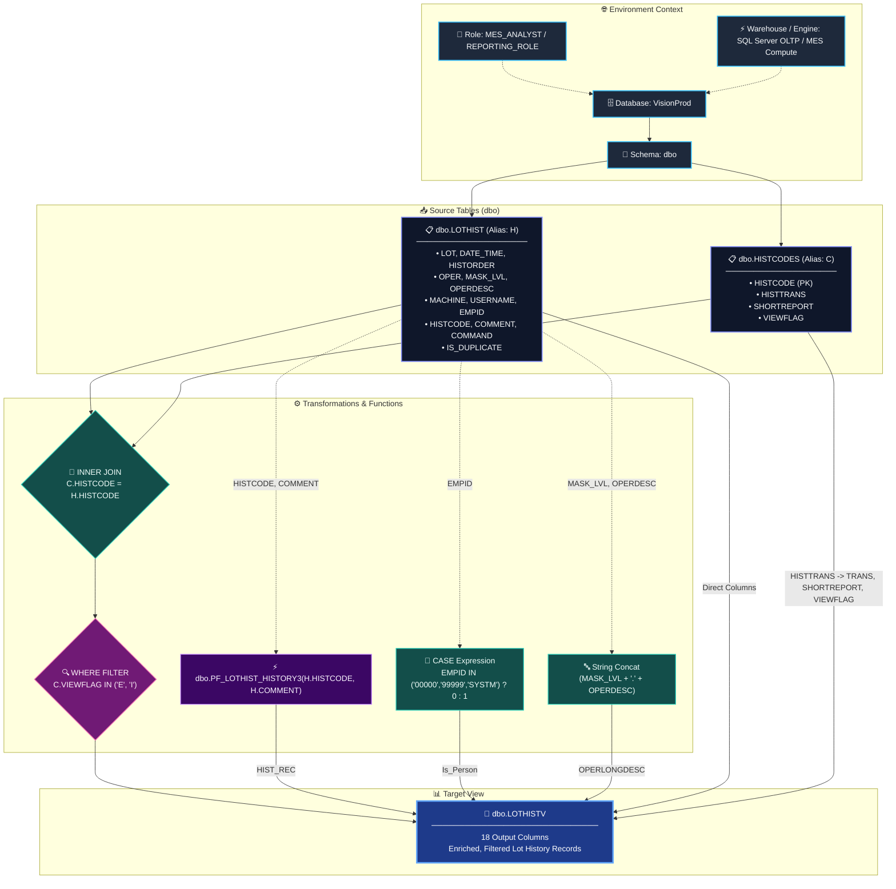
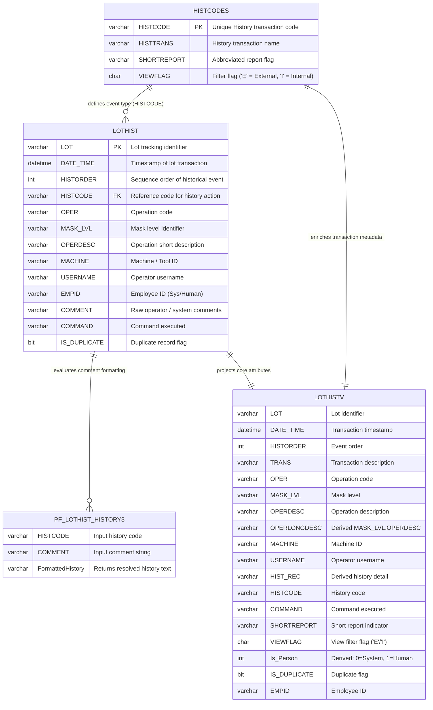

# 📊 View Documentation: `dbo.LOTHISTV`

> **Source System:** `VisionProd` &nbsp;|&nbsp; **Object Type:** `SQL View` &nbsp;|&nbsp; **Domain:** Semiconductor Manufacturing / WIP Lot History

---

## 📑 Table of Contents
1. [SQL View Definition](#-sql-view-definition)
2. [Environment & Object Metadata](#-environment--object-metadata)
3. [Architecture & Data Lineage Flowchart](#-architecture--data-lineage-flowchart)
4. [Entity Relationship (ER) Diagram](#-entity-relationship-er-diagram)
5. [Column Mapping & Transformation Catalog](#-column-mapping--transformation-catalog)
6. [Core Business Logic & Derivations](#-core-business-logic--derivations)
7. [Dependencies & Performance Considerations](#-dependencies--performance-considerations)

---

## 💻 SQL View Definition

```sql
CREATE VIEW [dbo].[LOTHISTV] (
    LOT, 
    DATE_TIME, 
    HISTORDER,
    TRANS, 
    OPER,
    MASK_LVL, 
    OPERDESC, 
    OPERLONGDESC,
    MACHINE, 
    USERNAME, 
    HIST_REC,
    HISTCODE, 
    COMMAND, 
    SHORTREPORT, 
    VIEWFLAG,
    Is_Person, 
    IS_DUPLICATE, 
    EMPID
) AS
SELECT 
    H.LOT, 
    H.DATE_TIME, 
    H.HISTORDER,
    C.HISTTRANS,
    H.OPER, 
    H.MASK_LVL, 
    H.OPERDESC, 
    (H.MASK_LVL + '.' + H.OPERDESC) AS OPERLONGDESC,
    H.MACHINE, 
    H.USERNAME,
    dbo.PF_LOTHIST_HISTORY3(H.HISTCODE, H.COMMENT) AS HIST_REC,
    H.HISTCODE, 
    H.COMMAND,
    C.SHORTREPORT, 
    C.VIEWFLAG,
    CASE 
        WHEN H.EMPID IN ('00000', '99999', 'SYSTM') THEN 0 
        ELSE 1 
    END AS Is_Person,
    H.IS_DUPLICATE,
    H.EMPID
FROM dbo.LOTHIST H (NOLOCK)
     INNER JOIN dbo.HISTCODES C (NOLOCK) 
         ON (C.HISTCODE = H.HISTCODE)
WHERE C.VIEWFLAG IN ('E', 'I')
GO
```

---

## 🏛️ Environment & Object Metadata

| Metadata Key | Environment / Object Specification | Description |
| :--- | :--- | :--- |
| **Database** | `VisionProd` | Production Manufacturing Execution System / MES Database |
| **Schema** | `dbo` | Default database schema owner |
| **View Name** | `[dbo].[LOTHISTV]` | Standard Lot History & Event Tracking View |
| **Assigned Role / Access** | `MES_ANALYST`, `DATA_CONSUMER_READ`, `REPORTING_ROLE` | Read-only reporting & audit access |
| **Compute / Warehouse** | Standard OLTP Engine / Reporting Warehouse Pool | Direct query & reporting execution layer |
| **Primary Source Tables** | `dbo.LOTHIST`, `dbo.HISTCODES` | Transactional lot events and history lookup codes |
| **Scalar Functions** | `dbo.PF_LOTHIST_HISTORY3` | Formatting & history string resolution function |
| **Concurrency Hints** | `(NOLOCK)` (Dirty Read / Read Uncommitted) | Used to prevent table locks during high-throughput lot processing |

---

## 🔀 Architecture & Data Lineage Flowchart

The following flowchart details the flow of data from source database layers, roles, and source tables through transformation rules into the target view.



---

## 📐 Entity Relationship (ER) Diagram



---

## 📋 Column Mapping & Transformation Catalog

| # | Target Column (`LOTHISTV`) | Source Expression | Source Table / Object | Transformation / Logic Type | Description |
| :-: | :--- | :--- | :--- | :--- | :--- |
| **1** | `LOT` | `H.LOT` | `dbo.LOTHIST` | Direct Pass-Through | Unique wafer lot identification number. |
| **2** | `DATE_TIME` | `H.DATE_TIME` | `dbo.LOTHIST` | Direct Pass-Through | Timestamp when the lot step was recorded. |
| **3** | `HISTORDER` | `H.HISTORDER` | `dbo.LOTHIST` | Direct Pass-Through | Sequential ordering index of the lot history event. |
| **4** | `TRANS` | `C.HISTTRANS` | `dbo.HISTCODES` | Lookup Column | Human-readable transaction type description. |
| **5** | `OPER` | `H.OPER` | `dbo.LOTHIST` | Direct Pass-Through | Operation step number or identifier. |
| **6** | `MASK_LVL` | `H.MASK_LVL` | `dbo.LOTHIST` | Direct Pass-Through | Photolithography mask layer level. |
| **7** | `OPERDESC` | `H.OPERDESC` | `dbo.LOTHIST` | Direct Pass-Through | Brief description of the manufacturing operation. |
| **8** | `OPERLONGDESC` | `(H.MASK_LVL + '.' + H.OPERDESC)` | `dbo.LOTHIST` | **Derived (Concatenation)** | Combines mask level and operation name (e.g. `M01.POLY_ETCH`). |
| **9** | `MACHINE` | `H.MACHINE` | `dbo.LOTHIST` | Direct Pass-Through | Specific fab tool / machine equipment ID used. |
| **10** | `USERNAME` | `H.USERNAME` | `dbo.LOTHIST` | Direct Pass-Through | Account username of operator or automation system. |
| **11** | `HIST_REC` | `dbo.PF_LOTHIST_HISTORY3(...)` | `dbo.PF_LOTHIST_HISTORY3` | **Derived (Scalar UDF)** | Formats and parses history code & raw comments into audit string. |
| **12** | `HISTCODE` | `H.HISTCODE` | `dbo.LOTHIST` | Direct Pass-Through | Primary transaction event code identifier. |
| **13** | `COMMAND` | `H.COMMAND` | `dbo.LOTHIST` | Direct Pass-Through | System command or MES action triggered. |
| **14** | `SHORTREPORT` | `C.SHORTREPORT` | `dbo.HISTCODES` | Lookup Column | Indicator/flag for summary reporting views. |
| **15** | `VIEWFLAG` | `C.VIEWFLAG` | `dbo.HISTCODES` | Filtered Lookup (`'E'`, `'I'`) | Visibility flag categorizing External ('E') or Internal ('I') views. |
| **16** | `Is_Person` | `CASE WHEN ... THEN 0 ELSE 1 END` | `dbo.LOTHIST` | **Derived (Conditional Flag)** | Returns `0` for automated/system accounts (`00000`, `99999`, `SYSTM`), else `1`. |
| **17** | `IS_DUPLICATE` | `H.IS_DUPLICATE` | `dbo.LOTHIST` | Direct Pass-Through | Flag indicating if the entry was logged as a duplicated event. |
| **18** | `EMPID` | `H.EMPID` | `dbo.LOTHIST` | Direct Pass-Through | Employee badge ID or system service identifier. |

---

## 💡 Core Business Logic & Derivations

### 1. Automated System vs. Human Operator Resolution (`Is_Person`)
Identifies whether the transaction was performed by a human operator or automated MES background system.
```sql
CASE 
    WHEN H.EMPID IN ('00000', '99999', 'SYSTM') THEN 0 
    ELSE 1 
END
```
* **Value `0`:** System Daemon / Automatic MES process.
* **Value `1`:** Human operator / engineer transaction.

### 2. Composite Operation Identifier (`OPERLONGDESC`)
Constructs a unified hierarchy representation combining the mask tier and step name:
```sql
(H.MASK_LVL + '.' + H.OPERDESC)
```

### 3. Formatted Audit Text Generation (`HIST_REC`)
Invokes the custom database scalar function `dbo.PF_LOTHIST_HISTORY3`:
```sql
dbo.PF_LOTHIST_HISTORY3(H.HISTCODE, H.COMMENT)
```
Translates raw delimited comments and codes into normalized event logs.

### 4. Record Filtering Criteria
Restricts results strictly to records classified under approved view flags:
```sql
WHERE C.VIEWFLAG IN ('E', 'I')
```
* `'E'`: External Visible Events
* `'I'`: Internal Operations Events

---

## ⚡ Dependencies & Performance Considerations

> [!NOTE]
> **Locking Strategy:** The view utilizes `(NOLOCK)` table hints on `dbo.LOTHIST` and `dbo.HISTCODES`. This provides non-blocking dirty reads for high-frequency operational queries but may read uncommitted data during active writes.

> [!TIP]
> **Recommended Indexes:**
> - `dbo.LOTHIST(HISTCODE)` (Foreign Key join optimization)
> - `dbo.HISTCODES(HISTCODE)` (Primary Key / Clustered)
> - `dbo.HISTCODES(VIEWFLAG) INCLUDE (HISTTRANS, SHORTREPORT)` (Covering index for filter condition)
> - `dbo.LOTHIST(LOT, DATE_TIME)` (For downstream lot-level historical range queries)
